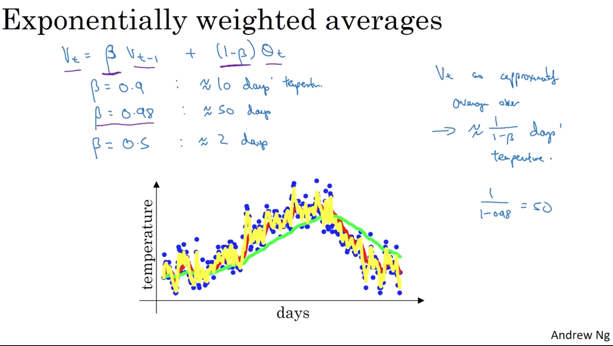
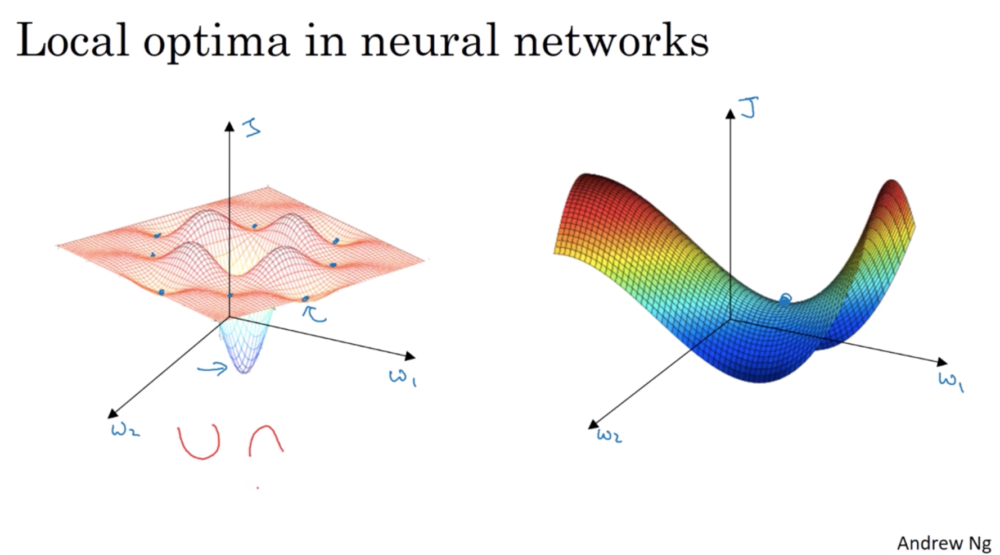
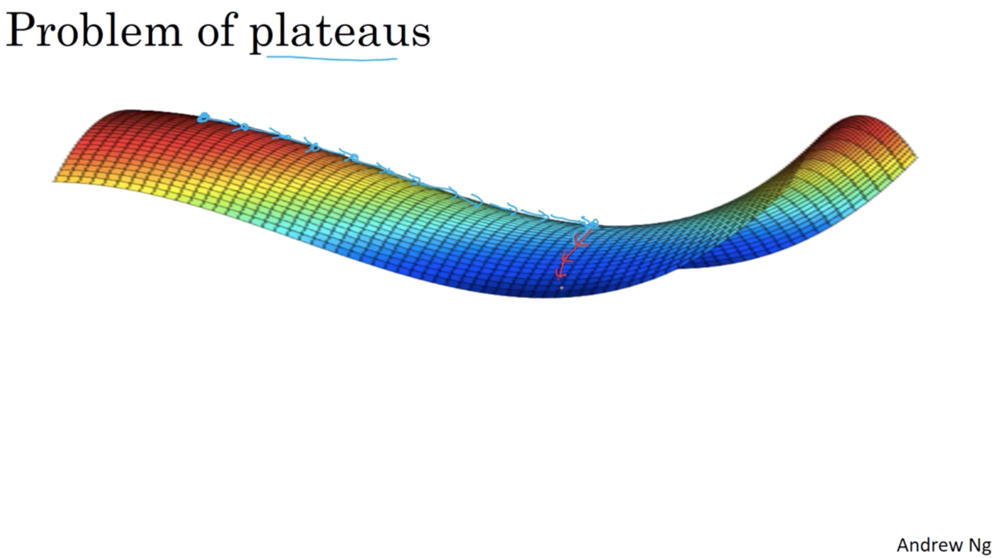

# week 2

 - Batch vs. Mini-batch gradient descent

    Mini-batch: $t$ represents the batch size
    $$
    X^{\{t\}}, Y^{\{t\}}
    $$

    For each batch:

    $$
    \begin{aligned}
        Z^{[l]} &= W^{[l]} X^{\{t\}} = b^{[l]} \\
        A^{[l]} &= g^{[l]}(Z^{[l]})
    \end{aligned}
    $$

    Go through all mini-batchs or pass through training set - epoch. That is:

    - Batch: one pass through training set, one gradient descent. Cost function curve always decreses

    - Mini-batch: one pass through training set, #sample/batch_size gradient descents. Cost function curve may not decrese on every iteration, it is oscillated.

- Choosing your mini-batch size

    - mini-batch size = m

        Batch gradient descent

    - mini-batch size = 1

        stochastic gradient descent

    - In practise, mini-batch size = in bwt. 1 and m. e.g. 64, 128, 258, 512, power of 2. Make sure mini-batch fit in CPU/GPU memory.

- Exponentially weighted average

    $$
    \begin{aligned}
        v_{t}&=\beta v_{t-1}+(1-\beta) \theta_{t} \\
        v_{t} &= (1-\beta)\theta_{t} + (1-\beta) \beta^1\theta_{t-1} + (1-\beta) \beta^2\theta_{t-2} + (1-\beta) \beta^3\theta_{t-3} + ... \\
        v_{t} &= \sum_{i=0}^{t}\Big[{(1-\beta) \beta^i \theta_{t-i}}\Big] 
    \end{aligned}
    $$
    $$
    recall: (1-\epsilon)^{\frac{1}{\epsilon}} = \frac{1}{e} \\
    \epsilon \rightarrow (1 - \beta)
    $$
    

- Bias correction in exponentially weighted average

    $$
    v_t := \frac{v_t}{1 - \beta^t}
    $$

    To conlcude this, we assume $\theta_i$ is all identical. So:

    $$
    \begin{aligned}
        v_t &= \theta \Big[ (1-\beta) + (1-\beta)\beta^1 + (1-\beta)\beta^2 + (1-\beta)\beta^3 +...\Big] \\
        &= \theta \Big[ 1 - \beta + \beta - \beta^2 + \beta^2 - \beta^3 + ... \Big] \\
        &= \theta \Big[ 1 - \theta^t \Big]
    \end{aligned}
    $$

    So $v_t := \frac{v_t}{1 - \beta^t}$ looks like make $v_t=\theta_t$

- Gradient descent with momentum

    On interation t: 
    
    compute $dw, db$ on current mini-batch:

    $$
    \begin{aligned}
        V_{dw} &= \beta V_{dw} + (1-\beta)dw \\
        V_{db} &= \beta V_{db} + (1-\beta)db
    \end{aligned}
    $$

    $$
    \begin{aligned}
        w &= w - \alpha V_{dw} \\
        b &= b - \alpha V_{db}
    \end{aligned}
    $$

- RMSprop - Root Mean Squared Prop

    On iteration t:

    comput $dw, db$ on current mini-batch

    $$
    \begin{aligned}
        S_{dw} &= \beta_2 S_{dw} + (1-\beta_2)dw^2 \\
    S_{db} &= \beta_2 S_{db} + (1-\beta_2)db^2
    \end{aligned}
    $$

    $$
    \begin{aligned}
        w &:= w - \alpha \frac{dw}{\sqrt{S_{dw}}}\\
        b &:= b - \alpha \frac{db}{\sqrt{S_{db}}}
    \end{aligned}
    $$

- Adam optimization algorithm

    Initialize $V_{d w}=0, S_{d w}=0, V_{db}=0, S_{db}=0$

    On iteration t:

    comput $dw, db$ using current mini-batch

    $$
    \begin{aligned}
        V_{d w}&=\beta_{1} v_{d w}+\left(1-\beta_{1}\right) d w \\ V_{d b}&=\beta_{1} V_{d b}+\left(1-\beta_{1}\right) d b \\
        S_{d w}&=\beta_{2} S_{d w}+\left(1-\beta_{2}\right) d w^{2}\\ S_{a b}&=\beta_{2} S_{d b}+\left(1-\beta_{2}\right) d b^2
    \end{aligned}
    $$

    $$
    \begin{aligned}
        V^{corrected}_{dw} &= \frac{V_{dw}}{(1-\beta^t_1)} \\
        V^{corrected}_{db} &= \frac{V_{db}}{(1-\beta^t_1)} \\
        S^{corrected}_{dw} &= \frac{S_{dw}}{(1-\beta_2^t)} \\
        S^{corrected}_{db} &= \frac{S_{db}}{(1-\beta_2^t)}
    \end{aligned}
    $$

    $$
    \begin{aligned}
        w &:= w - \alpha \frac{V^{corrected}_{dw}}{\sqrt{S_{dw}^{corrected}}+\epsilon} \\
        b &:= b - \alpha \frac{V^{corrected}_{db}}{\sqrt{S_{db}^{corrected}}+\epsilon}
    \end{aligned}
    $$

    Hyparameters choice:
    
    - $\alpha$ : needs to be tune
    - $\beta_1$ : 0.9
    - $\beta_2$ : 0.999
    - $\epsilon$ : $10^{-8}$

- Learning rate decay

    recall: one epoch = 1 pass through data

    $$
    \alpha = \frac{1}{1 + decay\_rate \cdot epoch\_num} \alpha_0
    $$

    Other learning rate decay methods

    $$
    \begin{aligned}
        \text{exponentially decay:}\\
        \alpha &= 0.95^{epoch\_num} \cdot \alpha_0 \\
        \text{descrete decay:}   \\
        \alpha &= \frac{k}{\sqrt{epoch\_num}}\cdot \alpha_0 
    \end{aligned}
    $$

- The problem of local optima

    saddle points.
    

- The problem of plateaus

    