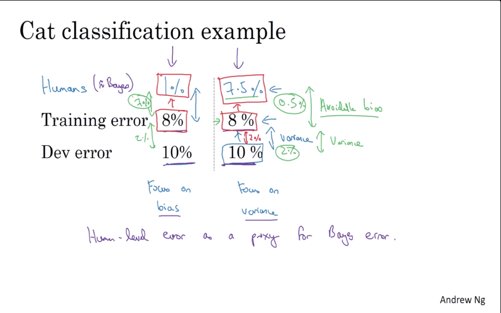
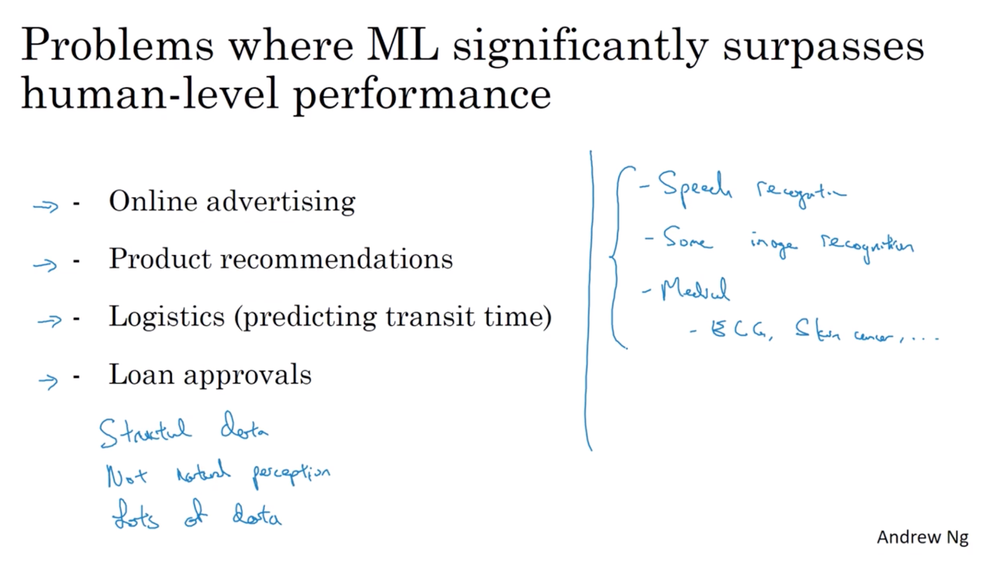

# week 1

- Orthogonalization

    chain of assumptions in ML

    
    fit training set well on cost function $\rightarrow$

    fit dev set well on cost function $\rightarrow$

    fit test set well on cost function $\rightarrow$

    performs well in real world

- setting up your goal

    - setting a single number evaluation metric, that convert multi evaluation metrics to a single metric.
    
        E.g. error from different fields then aggregate them to a average nuumber.

        E.g. $cost = accuracy - 0.5*runtime(ms)$, that is $\mathop{argmax}(accuracy) subject to runtime \leq 100 ms$

    - train/dev/test distributions

        Randomly shuffle into dev/test sets.

        Choose a dev set and test set to reflect data you expect to get in the future and consider importance to do well on.

    - splitting data

        in a modern Deep Learning era, it is reasonable to use much smaller than 20% or 30% of data for a dev set or a test set.

        - size of test set

            $$
            \begin{array}{l}{\text { Set your test set to be big enough to give high confidence }} \\ {\text { in the overall performance of your system. }}\end{array}
            $$

    - Orthogonalization for cat pictures

        $$
        \begin{array}{l}{\text { 1. So far we've only discussed how to define a metric to }} \\ {\text { evaluate classifiers. }} \\ {\text { 2. Worry separately about how to do well on this metric. }}\end{array}
        $$

        $$
        \begin{array}{l}{\text { If doing well on your metric }+\text { dev/test set does not }} \\ {\text { correspond to doing well on your application, change your }} \\ {\text { metric and/or dev/test set. }}\end{array}
        $$

- Comparing to human-level performance

    

    human are good at natural perception problems, but not really good at structured data.

    

    The two fundamental assumptions of supervised learning

    - you can fit the training set pretty well
    - The training set performance generalized pretty well to the dev/test set

    - avoidable bias
      - train bigger model
      - train longer/better optimization algorithms: momentum, RMSprop, Adam
      - NN architecture/hyperparameters search
    - variance
      - more data
      - regularization: L2, dropout, data, augmentation
      - NN architecture/hyperparameters search

