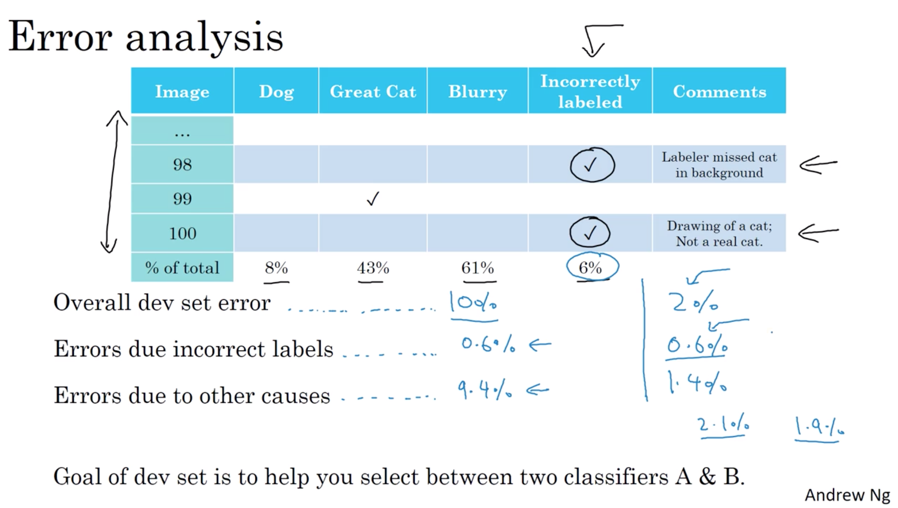
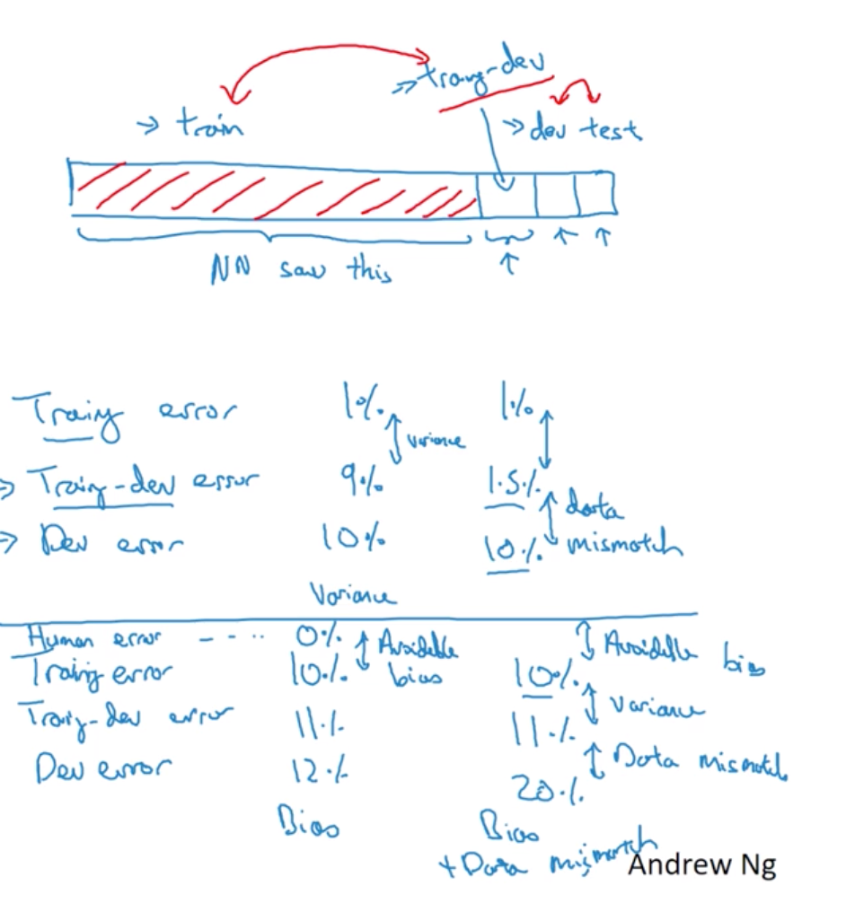
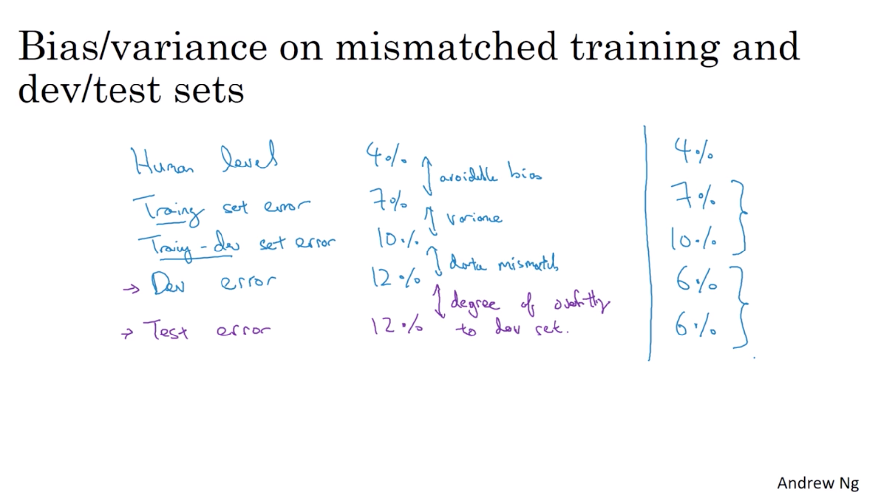
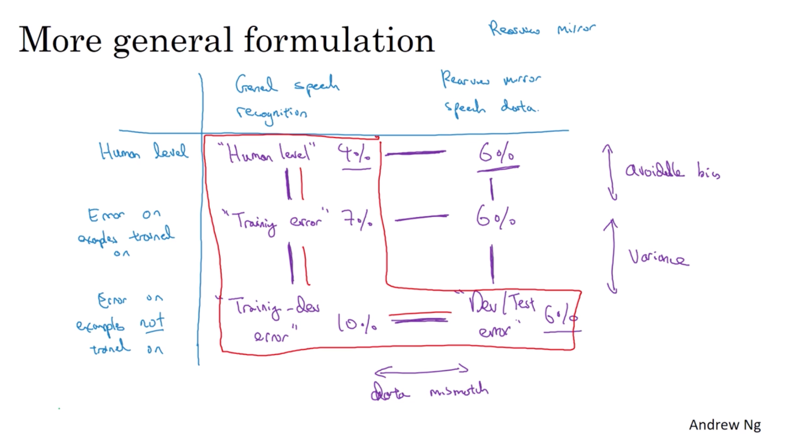
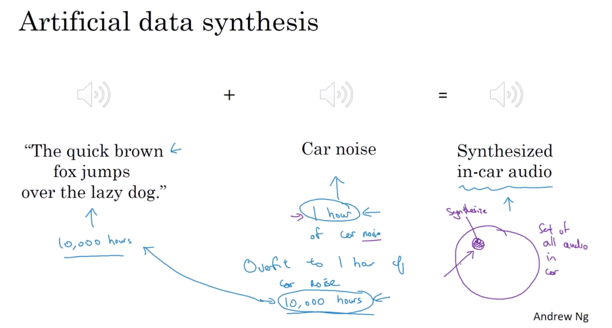
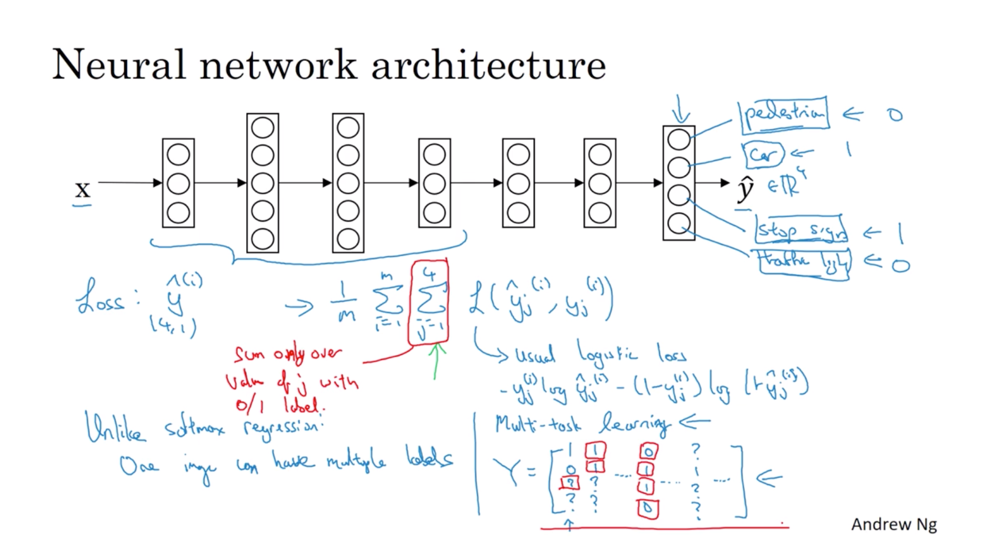

# week 2

- Error analysis

    $$
    \begin{array}{l}{\text { Ideas for cat detection: }} \\ {\cdot \text { Fix pictures of dogs being recognized as cats }} \\ {\cdot \text { Fix great cats (lions, panthers, etc..) being misrecognized }} \\ {\cdot \text { Improve performance on blurry images }}\end{array}
    $$

    - cleaning up incorrectly labeled data

        

        $$
        \begin{array}{l}{\cdot \text { Apply same process to your dev and test sets to }} \\ {\text { make sure they continue to come from the same }} \\ {\text { distribution }} \\ {\cdot \text { Consider examining examples your algorithm got }} \\ {\text { right as well as ones it got wrong. }} \\
        {\cdot \text { Train and dev/test data may now come from }} \\ {\text { slightly different distributions. }}\end{array}
        $$

    - buld your first system quickly, then iterate

        - set up dev/test set and metric
        - build initial system quickly
        - use Bias/Variance analysis & error analysis to prioritize next steps

- Mismatched training and dev/test set

    - training and testing on different distributions

        data from webpages $\approx 200,000$

        data from mobile app $\approx 10,000$

        strategy:
        - $200,000 web + 5,000 app$ for training
        - $2,500 app$ for dev
        - $2,500 app$ for test

        because we care about the app images, so we use app images for both dev and test.

    - Bias and Variance with mismatched data distributions

        Training-dev set: Same distribution as training set, but not used for training.(For checking whether mismatched training and dev/test set)

        

        

        

    - addressing data mismatch

        $$
        \begin{array}{l}{\cdot \text { Carry out manual error analysis to try to understand difference }} \\ {\text { between training and dev/test sets }}\\
        {\cdot \text { Make training data more similar; or collect more data similar to }} \\ {\text { dev/test sets }}\end{array}
        $$

        - artificial data synthesis

        

- Learning from multiple tasks

    - Transfer learning

        When transfer learning makes sense.(Transfer from A $\rightarrow$ B)

        - Task A and B have the same input X
        - You have a lot more data for Task A than Task B
        - Low level features from A could be helpful for learning B

    - Multi-task learning

        start off simultaneously, tring to have one neural network do several at the same time.

        Use multi-units in the output layer with logistic for each class.

        $$
        \begin{aligned}
            \mathop{cost} &= \frac{1}{m} \sum_{i=1}^m \sum_{j=1}^n\mathclap{L}\left(\hat{y}_j^{(i)}, y_j^{(i)}\right) \\
            \mathclap{L}\left(\hat{y}_j^{(i)}, y_j^{(i)}\right) &= -y_j^{(i)}\log\hat{y}_j^{(i)} - (1-y_j^{(i)})\log(1-\hat{y}_j^{(i)})
        \end{aligned}
        $$

        

        When nulti-task learning makes sense

        - training on a set of tasks that could benefit from having shared lower-level features
        - Usually: Amount of data you have for each task is quite similar
        - Can train a big enough neural network to do well on all the tasks

- End-to-end learning

    There have been some data processing systems, or learning systems that require multiple stages of processing. And what end-to-end deep learning does, is it can take all those multiple stages, and replace it usually with just a single neural network.

    - Whether to use end-to-end deep learning

        Pros:
        - let the data speak
        - less hand-designing of components needed

        Cons:
        - may need large amount of data
        - excludes potentially useful hand-designed components