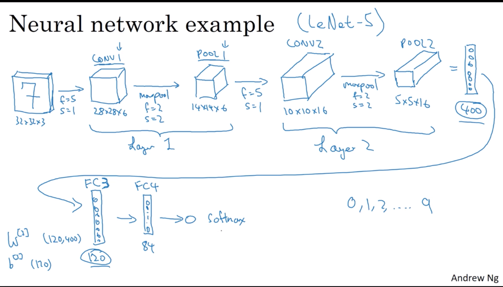
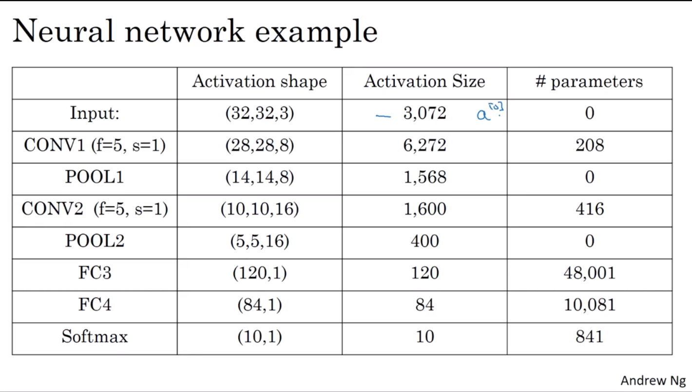

# week 1

- Computer vision problems
  - image classification
  - object detection
  - neural style transfer

- Edge detection

    - vertical edge detection

        $$
        \begin{array}{|c|c|c|}\hline 1 & {0} & {-1} \\ \hline 1 & {0} & {-1} \\ \hline 1 & {0} & {-1} \\ \hline\end{array}
        $$
    
    - horizontal edge detection

        $$
        \begin{array}{|c|c|c|}\hline 1 & {1} & {1} \\ \hline 0 & {0} & {0} \\ \hline-1 & {-1} & {-1} \\ \hline\end{array}
        $$

    - Sobel filter

        puts a little bit more weight to the central row, makes it maybe a little bit more robust.

        $$
        \begin{array}{|c|c|c|}\hline 1 & {0} & {-1} \\ \hline 2 & {0} & {-2} \\ \hline 1 & {0} & {-1} \\ \hline\end{array}
        $$

    - Scharr filter

        $$
        \begin{array}{|c|c|c|}\hline 3 & {0} & {-3} \\ \hline 10 & {0} & {-10} \\ \hline 3 & {0} & {-3} \\ \hline\end{array}
        $$
    
- Padding

    - Valid convolution - no padding
    - Same convolution - pad so that size is the same as the input size

- Strided convolutions

    Technical note on cross-correlation vs. convolution

    Actually, the convolution is needed to flip the filer on horizontal and vertical axis and then convole, so what the operation we learn there is better called cross-correlation. But for convenience, we just skip the narror flip op, and call it convolution.

- Summary of convolutions
  
    $$
    \begin{array}{ll}{n \times n \text { image }} & {f \times f \text { filter }} \\ {\text { padding } p} & {\text { stride } s}\end{array}
    $$

    output size:

    $$
    \left\lfloor\frac{n+2 p-f}{s}+1\right\rfloor \times \quad\left\lfloor\frac{n+2 p-f}{s}+1\right\rfloor
    $$

- Convolutions over volumne

    Summary:

    $$
    n \times n \times n_{channels} \xrightarrow{convolution} f \times f \times n_{channels} \rightarrow n-f+1 \times n-f+1 \times n_{\#filters}
    $$

- One layer of a convolutional network

    - Number of parameters in one layer

        $$
        \left( \text{filter\_width} \times \text{filter\_height} \times \text{input\_\#channels}+ 1(bias) \right) \times \text{\#filters}
        $$

    - summary of notation

        $$
        \begin{array}{l}{\text { If layer } 1 \text { is a convolution layer: }} \\ {f^{[l]}=\text { filter size }} \\
        p^{[l]}=\text { padding } \\
        s^{[l]}=\text { stride } \\
        n_{c}^{[l]}=\text { number of filters } \\
        \text{each filter is:} f^{[l]}\times f^{[l]}\times n^{[l-1]}_{channels}\\
        \text{weights:} f^{[l]}\times f^{[l]}\times n^{[l-1]}_{channels} \times n^{[l]}_{c}\\
        \text{bias:}n_c^{[l]} \rightarrow (1,1,1,n^{[l]}_c)\\
        \text{activations:} a^{[l]} \rightarrow n_{H}^{[l]}\times n_{W}^{[l]} \times n_{c}^{[l]}\\
        \end{array}
        $$

        input:
        $$
        \begin{array}{l}
            n_{H}^{[l-1]}\times n_{W}^{[l-1]} \times n_{c}^{[1-1]}\\
        \end{array}
        $$
        output:
        $$
        \begin{array}{l}
            n_{H}^{[l]}\times n_{W}^{[l]} \times n_{c}^{[l]}
        \end{array} 
        $$
        $$
        n^{[l]}_{H/W} = \lfloor \frac{n^{[l-1]} + 2p^{[l]} - f^{[l]}}{s^{[l]}} + 1 \rfloor
        $$

- Simple convolutional network example

    types of layers in a convolutional network
    - Convolution (CONV)
    - Pooling (POOL)
    - Fully connected (FC)

- Pooling layers

    - Max pooling
    - Average pooling

    Hyperparameters:
    $$
    \begin{array}{l}{\text { f: filter size }} \\ {\text { s : stride }} \\ {\text { Max or average pooling }}\end{array}
    $$

    Input size:
    $$
    n_H \times n_W \times n_c
    $$
    Output size:
    $$
    \lfloor\frac{n_H - f}{s}+1\rfloor \times \lfloor \frac{n_W-f}{s}+1 \rfloor \times n_c
    $$

- CNN example

    

    

- Why convolutions?

    $$
    \begin{array}{l}{\text { Parameter sharing: A feature detector (such as a vertical }} \\ {\text { edge detector) that's useful in one part of the image is probably }} \\ {\text { useful in another part of the image. }}\\ \\
    {\text { Sparsity of connections: In each layer, each output value }} \\ {\text { depends only on a small number of inputs. }}\end{array}
    $$
    
- backford propagation

    - $dW_c$

    $$
    d W_{c}+=\sum_{h=0}^{n_{H}} \sum_{w=0}^{n_{W}} a_{s l i c e} \times d Z_{h w}
    $$

    - $db$

    $$
    d b=\sum_{h} \sum_{w} d Z_{h w}
    $$

    - $dA$

    $$
    d A+=\sum_{h=0}^{n_{H}} \sum_{w=0}^{n_{W}} W_{c} \times d Z_{h w}
    $$