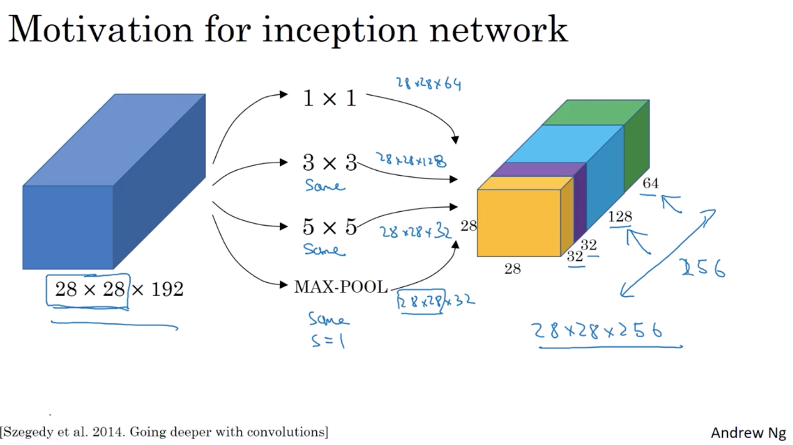

# week 2

- Case study

    Classic networks:
    $$
    \begin{array}{l}\\ {\cdot \text { LeNet- } 5} \\ {\cdot \text { AlexNet }} \\ {\cdot \text { VGG }}\end{array}
    $$
    - classic networks

        - LeNet - 5

            $$
            \begin{array}{l}
                32 \times 32 \times 1 \xrightarrow{5\times 5, s=1} \\ 
                28 \times 28 \times 6 \xrightarrow{avg pool, f=2,s=2} \\
                14\times 14\times6 \xrightarrow{5\times 5, s=1} \\
                10 \times 10 \times 16 \xrightarrow{avg pool,f=2,s=2}\\
                5 \times 5\times 16 =400 \xrightarrow{FC}\\
                120 \xrightarrow{FC}\\
                84 \xrightarrow{FC, softmax} 10 (\hat{y})
            \end{array}
            $$
            Using sigmoid/tanh as activation function

        - AlexNet

            $$
            \begin{array}{l}
                227 \times 227 \times 3 \xrightarrow{11\times 11, s=4}\\
                55\times 55\times 96 \xrightarrow{max-pool,3\times 3, s=2}\\
                27\times 27\times 96 \xrightarrow{5\times 5, same}\\
                27 \times 27\times 256 \xrightarrow{max-pool,3\times 3, s=2}\\
                13\times 13\times 256 \xrightarrow{3\times 3, same}\\
                13\times 13\times 384 \xrightarrow{3\times 3,same}\\
                13\times 13\times 384 \xrightarrow{3\times 3,same}\\
                13\times 13\times 256 \xrightarrow{max-pool,3\times 3,s=2}\\
                6\times 6\times 256 =9216 \xrightarrow{FC}\\
                4096 \xrightarrow{FC}\\
                4096 \xrightarrow{FC,softmax}1000 (\hat{y})
            \end{array}
            $$
            Using ReLU as activation function

        - VGG - 16

            $$
            \begin{array}{lcr}
                &\text{CONV}=3\times 3 \text{  filter,} s=1, same &
                &\text{MAX-POOL} = 2\times 2, s=2
            \end{array}
            $$

            $$
            \begin{array}{lc}
                224\times 224\times 3 \xrightarrow{CONV 64 \times 2}\\
                224\times 224\times 64 \xrightarrow{POOL}\\
                112 \times 112\times 64 \xrightarrow{CONV 128 \times 2}\\
                112\times 112\times 128 \xrightarrow{POOL}\\
                56\times 56\times 128 \xrightarrow{CONV 256 \times 3}\\
                56\times 56\times 256 \xrightarrow{POOL}\\
                28\times 28\times 256 \xrightarrow{CONV 512 \times 3}\\
                28\times 28\times 512 \xrightarrow{POOL}\\
                14\times 14\times 512 \xrightarrow{CONV 512\times 3}\\
                14 \times 14\times 512 \xrightarrow{POOL}\\
                7\times 7\times 512 =25088 \xrightarrow{FC}\\
                4096 \xrightarrow{FC}
                4096 \xrightarrow{FC, softmax}1000(\hat{y})
            \end{array}
            $$

    - ResNet

        - Residual block

            Adding $a^{[l]}$ to $z^{[l+2]}$, that is making a shortcut/skip connection fron layer $l$ output to layer $l+2$ activation input. 
            $$
            z^{[l+1]}=W^{[l+1]} a^{[l]}+b^{[l+1]} \quad a^{[l+1]}=g\left(z^{[l+1]}\right)
            $$
            $$
            z^{[l+2]}=W^{[l+2]} a^{[l+1]}+b^{[l+2]} \quad a^{[l+2]}=g\left(z^{[l+2]} + a^{[l]}\right)
            $$
            
            

            difference of dimension, then use weight $W_s$ matrix to create zero padding or matrix of parameter we learned.
            $$\begin{aligned}{l}
                a^{[l+2]} &= g\left(z^{[l+2]} + W_sa^{[l]}\right)\\
                &=g \left(w^{[l+2]}a^{[l+1]}+b^{[l+2]} + W_sa^{[l]}\right)\\
                &=g\left(a^{[l]}\right) \text{if }w^{[l+2]}=0, b^{[l+2]}=0
            \end{aligned}
            $$
            

    - $1\times 1 convolution$

        also call network in network
        $$
        \left(n_W \times n_H \times n_C \right) \circledast \left(1 \times 1\times n_C \times \#filters \right) \rightarrow \left(n_W \times n_H\times \#filters\right)
        $$
        

    - inception network motivation

        - motivation for inception network

            Let the network learn what hyperparameters to use i.e. kernel size.
            

        - the problem of computational cost

            cost calculation:
            $$
            28\times 28\times 192 \xRightarrow{\text{CONV}, 5\times 5,same,32,5\times 5\times 192} 28\times 28\times 32
            $$
            $$
            \begin{array}{ll}
                \text{computational cost:}\\
                (28\times 28\times 32)_{\text{numer of output values need to compute}}\times (5\times 5\times 192)_{\text{for each output value} } = 120 \text{million}
            \end{array}
            $$

        - Using $1\times 1$convolution

            $$
            \begin{array}{ll}
                28\times 28\times 192 \xrightarrow{\text{CONV},1\times 1, 16, 1\times 1\times 192}\\
                28\times 28\times 16 (\text{bottelneck layer})\xrightarrow{\text{CONV},5\times 5,32,5\times 5\times 16}
                28\times 28\times 32
            \end{array}
            $$
            $$
            \begin{array}{ll}
                \text{computational cost:}\\
                (28\times 28\times 16)_{\text{numer of output values need to compute}} \times (1\times 1\times 192)_{\text{for each output value} } = 2.4 \text{million}\\
                +\\
                (28\times 28\times 32)_{\text{numer of output values need to compute}} \times (5\times 5\times 16)_{\text{for each output value} } = 10.0 \text{million}
            \end{array}
            $$
    
    - inception network

        - inception module

            

        - inception network

            

- Practical advices for using ConvNets

    - learn about the implemented codes from open-sourse platform

    - transfer learning

        load pre-trained model's weights, according the training dataset you have, to choose how many layers you can train in your transfer model. If having tons of dataset, you can use the weights as initialized weights to train model.

    - data augmentation

        - Mirroring
        - Random Cropping
        - Rotation
        - Shearing
        - Local warping...
        - Color shifting (PCA color agumentation)
        - Implementing distortions during training
        
