# week 3 Detection algorithms

- Object algorithm

    - **object localization**
      - Classification with localization

        target label $y$: object classes and bounding boxes($b_x, b_y, b_h, b_w$)

        $$
        y=\begin{vmatrix}
            P_c(\text{is there any object?})\\
            b_x\\
            b_y\\
            b_h\\
            b_w\\
            c_1\\
            c_2\\
            c_3
        \end{vmatrix}
        $$
        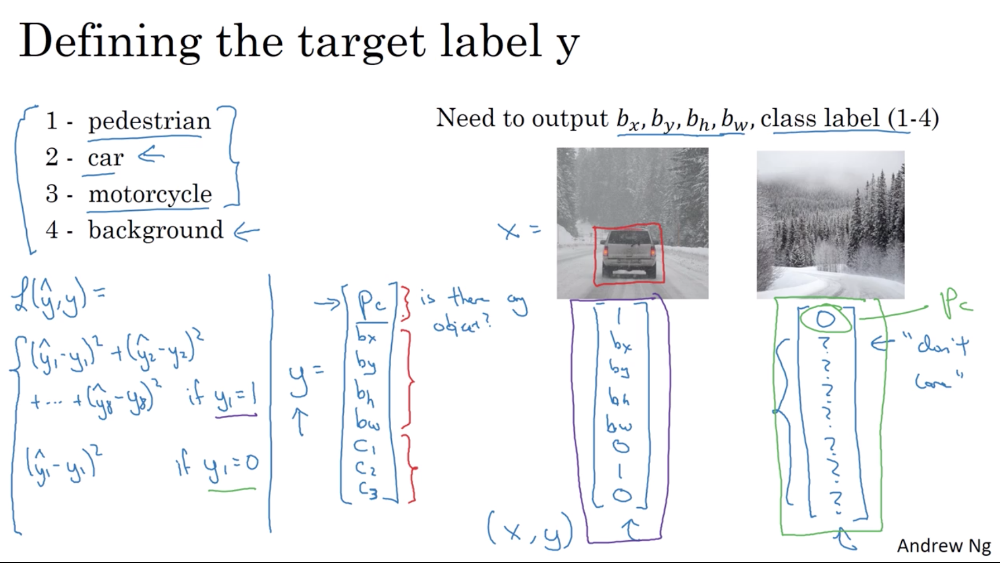

    - **Landmark detection**

        Regression for each landmark point coordinates

        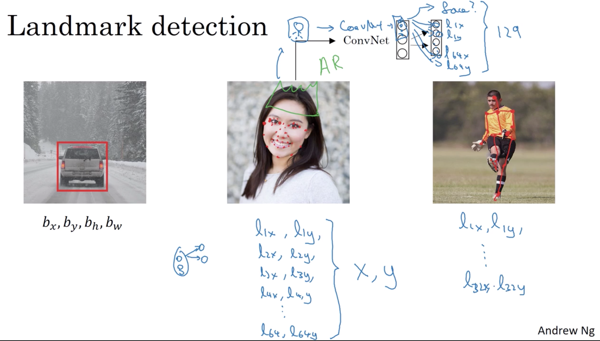

    - **object detection**

        - sliding windows detection

            different size, then slide windows on whole image, classify every square regions.
        - convolutional implementation of sliding windows

            turning FC layers into convolutional layers

        - classic CONV network architecture
        $$
        \begin{array}{ll}
            14\times 14 \times 3 \xRightarrow{5\times 5}\\
            10\times 10\times 16 \xRightarrow{MAX-POOL, 2\times 2}\\
            5\times 5\times 16 \xRightarrow{FC}\\
            400 \xRightarrow{FC}400 \xRightarrow{\text{softmax}}4\hat{y}
        \end{array}
        $$
        - Converting to fully convolutional network
        $$
        \begin{array}{ll}
            14\times 14 \times 3 \xRightarrow{5\times 5}\\
            10\times 10\times 16 \xRightarrow{MAX-POOL, 2\times 2}\\
            5\times 5\times 16 \xRightarrow{\text{'FC'/CONV},5\times 5\times 16\times 400}\\
            1\times 1\times 400 \xRightarrow{\text{'FC'/CONV,}1\times 1\times 400\times 400}\\
            1\times 1\times 400 \xRightarrow{\text{CONV,}1\times 1\times 400\times 4}\\
            1\times 1\times 4(\hat{y})
        \end{array}
        $$

        illustrating:
        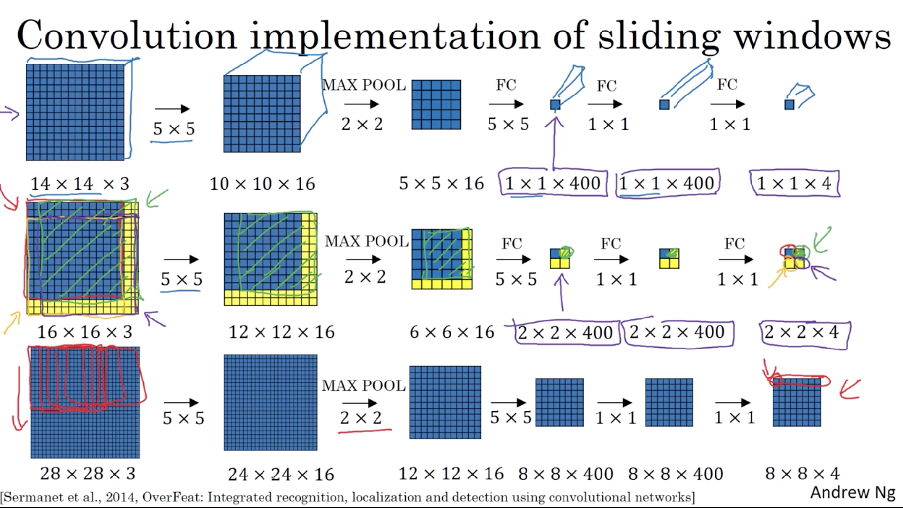

    - **bounding box predictions**
        
        - TOLO algorithm (you only look once)
            
            (note: I think the main idea of YOLO is similar with the fully CONV network)
            1. splitting entire image(not explicitly split, the input shape is still original shape) into grid, each grid cell correpsonds to one pixel in target tensor
            2. applying object classification and localization on each grid cell
            3. concret the label to the new set, just simply assign each grid

            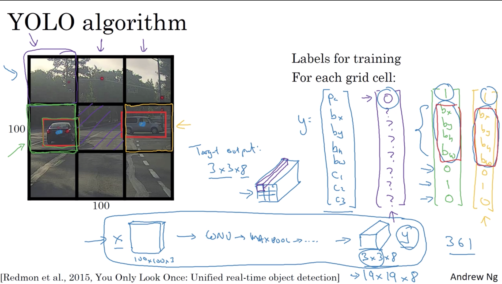
        
            Specify the bounding boxes:

            fraction of the grid cell. Remain each grid cell has identical height and width, using ratio is reasonable.
            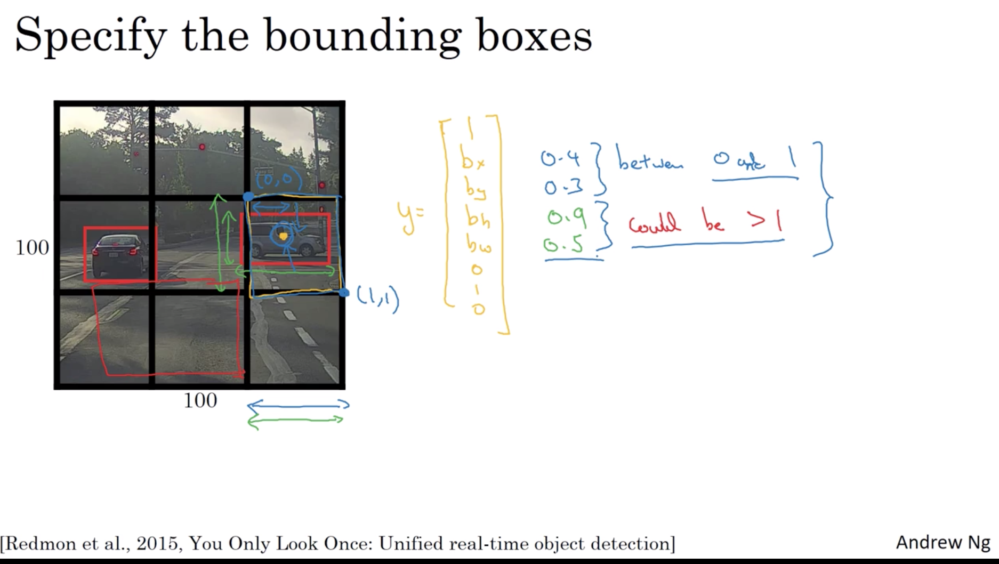

    - **Intersection over union(IoU)**

        $$
        IoU = \frac{\text{size of overlap area}}{\text{size of union area}}
        $$

    - **non-max suppression example(for YOLO)**

        non-max means the probability for each class/the chance of object.
        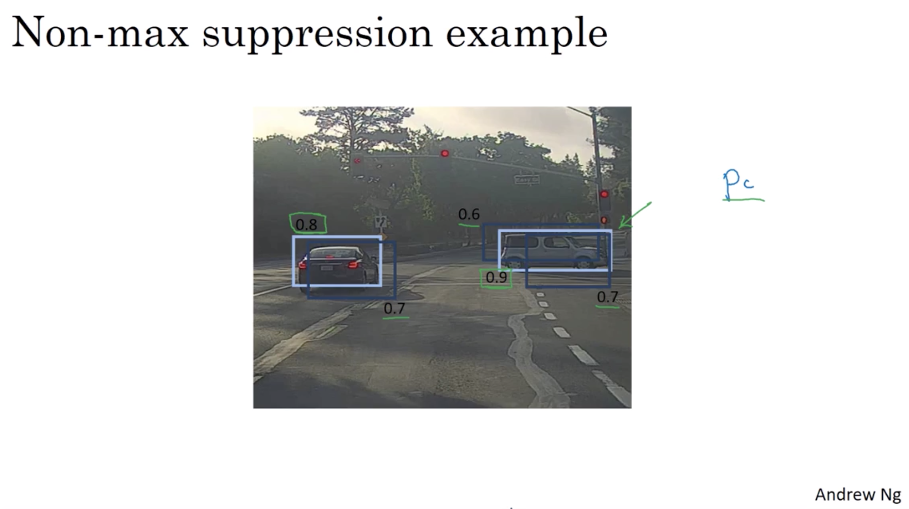
        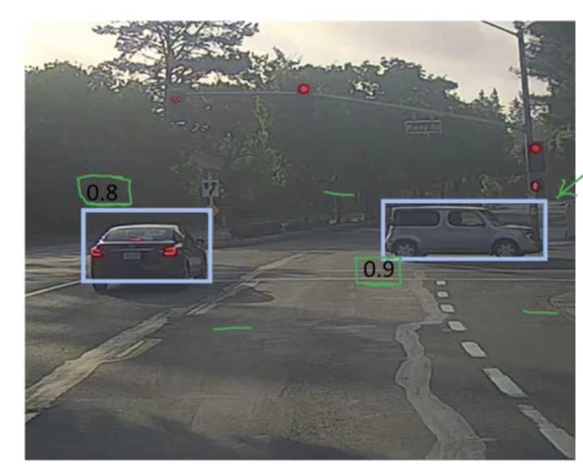

        steps illustrate:
        1. each output prediction is:
        $$
        \begin{vmatrix}
            p_c\\
            b_x\\
            b_y\\
            b_h\\
            b_w\\
            c_1\\
            c_2...
        \end{vmatrix}
        $$
        2. discard all boxes with $p_c \leq0.6$
        3. while there are any remaining boxes:
           1. pick the box with the largest $p_c$ output that as a prediction.
           2. discard any remaining box with IoU $\geq 0.5$ with the box output in the previous step.

    - **anchor boxes(for YOLO)**

        Predefined anchor boxes.
        $$
        \begin{array}{ll}{\text { Previously: }} \\ {\text { Each object in training }} \\ {\text { image is assigned to grid }} \\ {\text { cell that contains that }} \\ {\text { object's midpoint. }}\end{array}\\
        output y: 3\times 3\times 8
        $$
        $$
        \begin{array}{l}{\text { With two anchor boxes: }} \\ {\text { Each object in training }} \\ {\text { image is assigned to grid }} \\ {\text { cell that contains object's }} \\ {\text { midpoint and anchor box }} \\ {\text { for the grid cell with }} \\ {\text { highest IoU. }}\end{array}\\
        output y:  3\times 3\times 16 = 3\times 3\times 2\times 8
        $$

        example:
        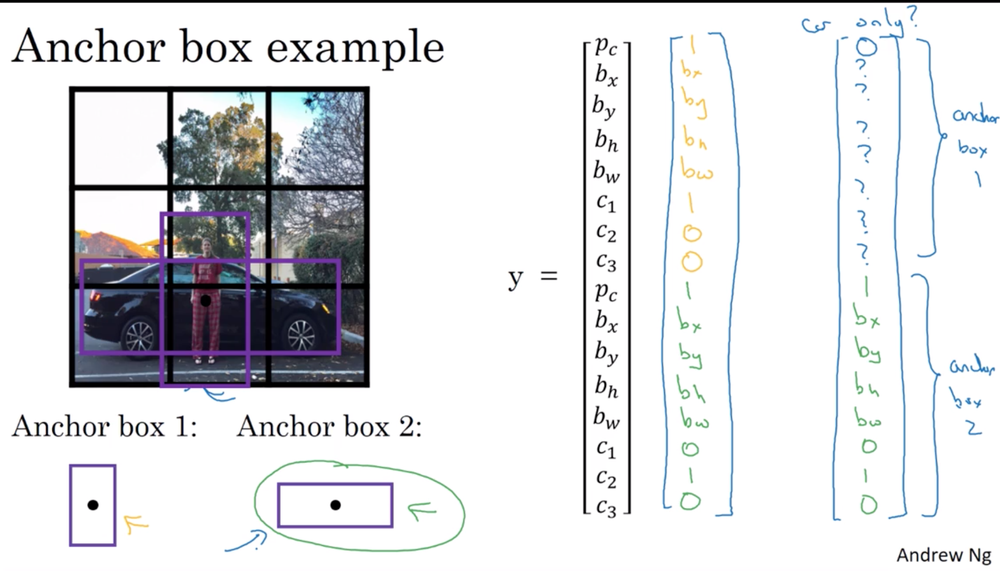

    - **YOLO algorithm**

        - training

            Assuming we have three classes, then y is:
            $$
            \begin{array}{ll}
                3\times 3\times 2\times 8\\
                \text{grid\_size, grid\_size, \#anchor, 5+\#classes}
            \end{array}
            $$
            In below example, there are two anchors
            $$
            \left[ \begin{array}{l}
            {p_{c}} \\ {b_{x}} \\ {b_{y}} \\ {b_{h}} \\ {b_{w}} \\ {c_{1}} \\ {c_{2}} \\ {c_{3}} \\ {p_{c}} \\ {b_{x}} \\ {b_{y}} \\ {b_{h}} \\ {b_{w}} \\ {c_{1}} \\ {c_{2}} \\ {c_{3}}
            \end{array}\right]
            $$

            illustrate:
            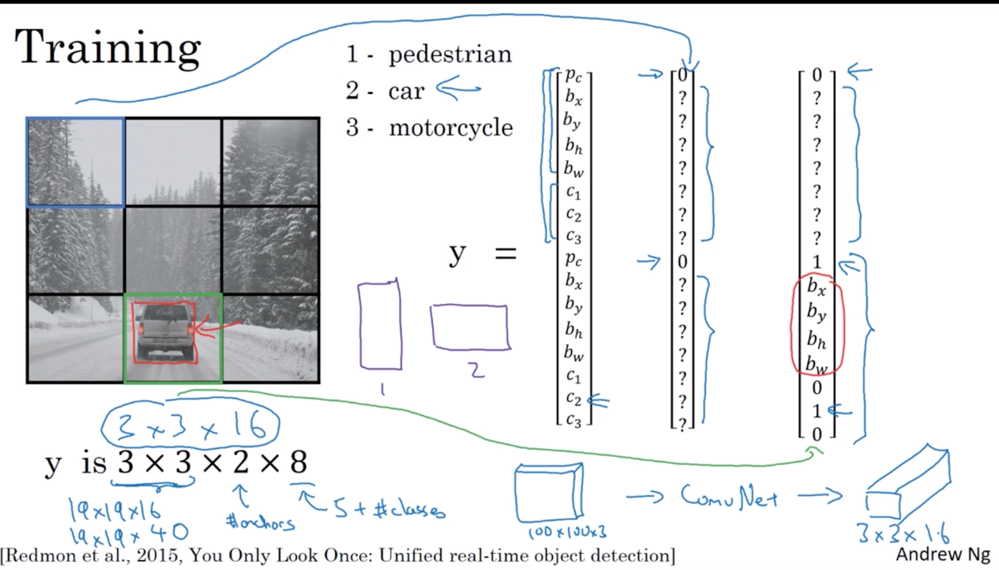
        
        - making predictions

            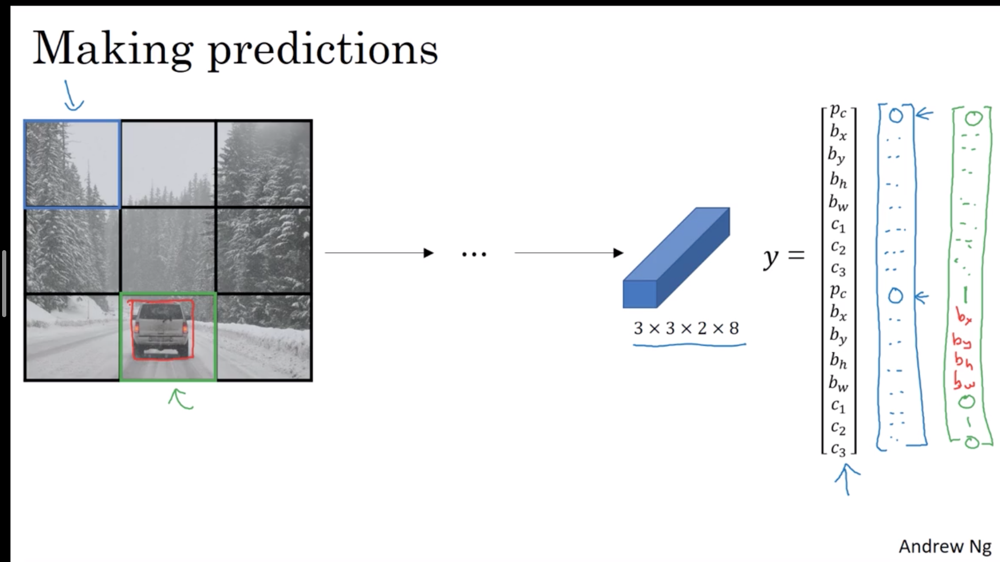

        - outputing the non-max suppressed outputs

            1. assuming we use 2 anchor boxes, so for each grid cell, get 2 predicted bounding boxes.
            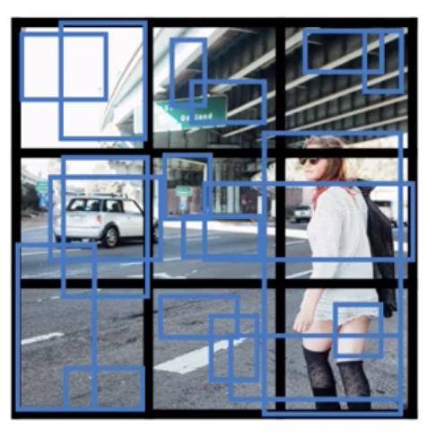
            3. get rid of low probability predicitons.
            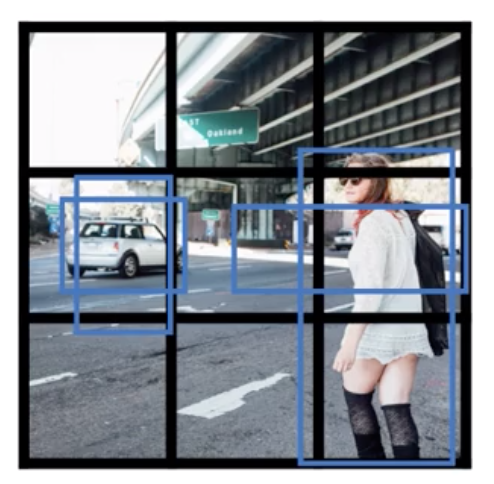
            5. for each class(pedestrian, car, motorcycle) use non-max suppression to generate final predictions.
            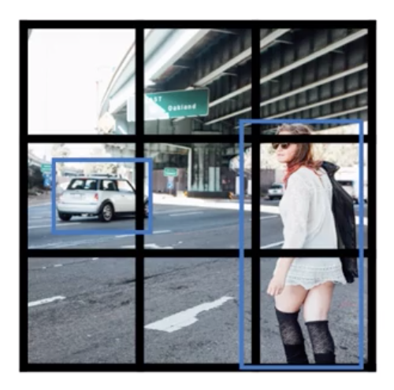

        - **Region proposals (R-CNN)**

            using segmentation algorithm to proposal regions.

            Faster algorithms

            R-CNN
            $$
            \begin{array}{l}{\text { Propose regions. Classify proposed regions one at a }} \\ {\text { time. Output label + bounding box. }}\end{array}
            $$

            Fast R-CNN
            $$
            \begin{array}{l}{\text { Propose regions. Use convolution implementation }} \\ {\text { of sliding windows to classify all the proposed }} \\ {\text { regions. }}\end{array}
            $$

            Faster R-CNN
            $$
            \text { Use convolutional network to propose regions. }
            $$

    - more detail illustration for YOLO

    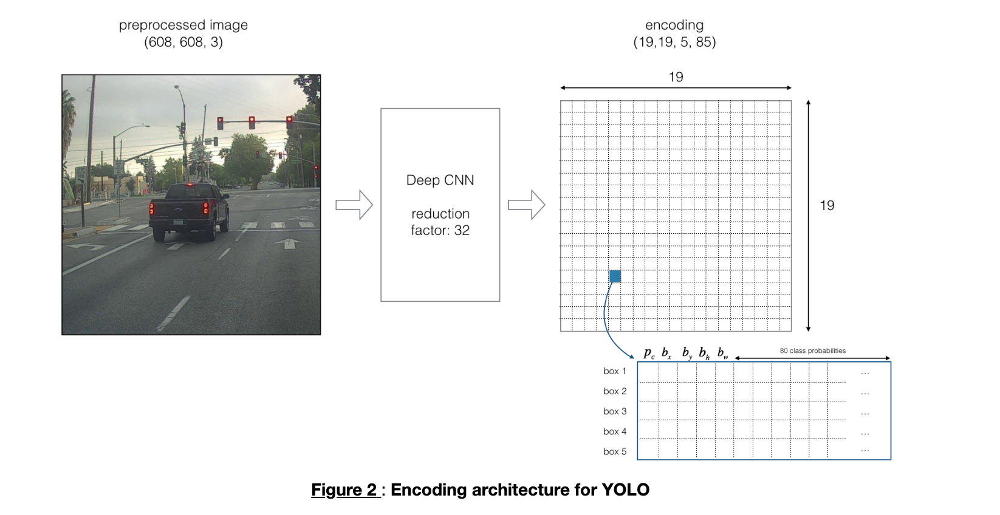

    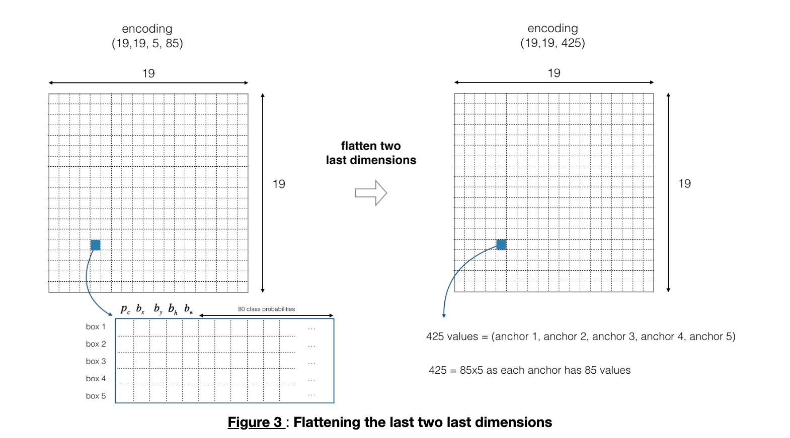

    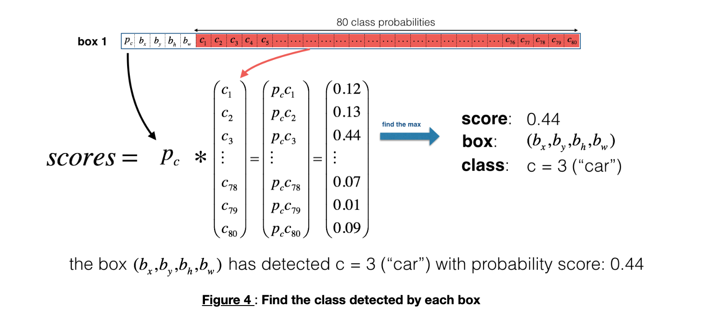