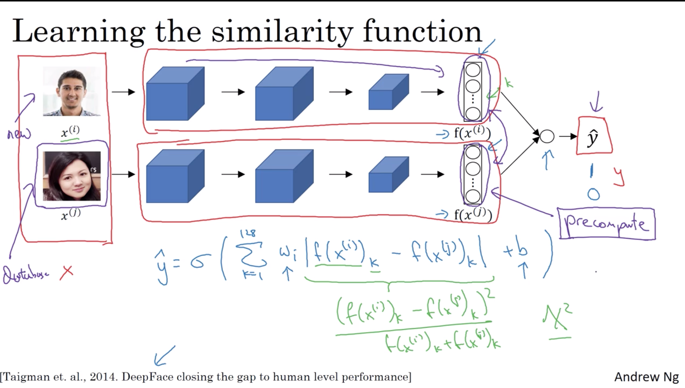
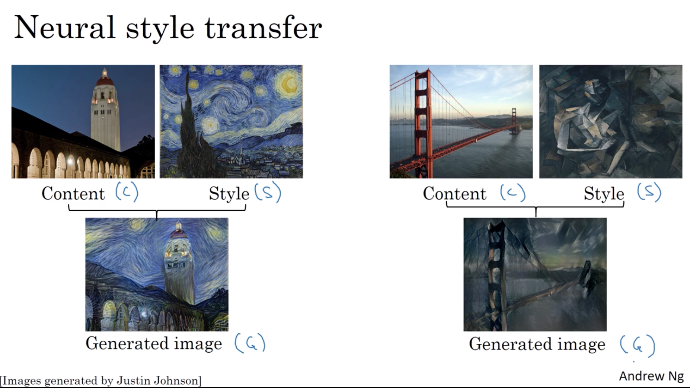
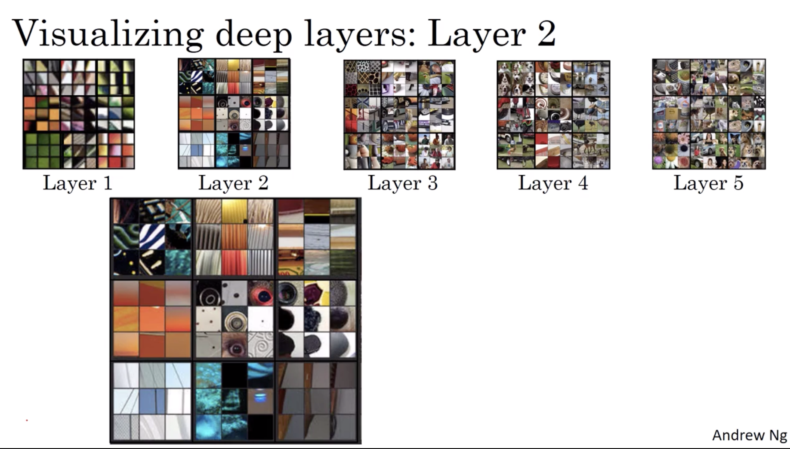
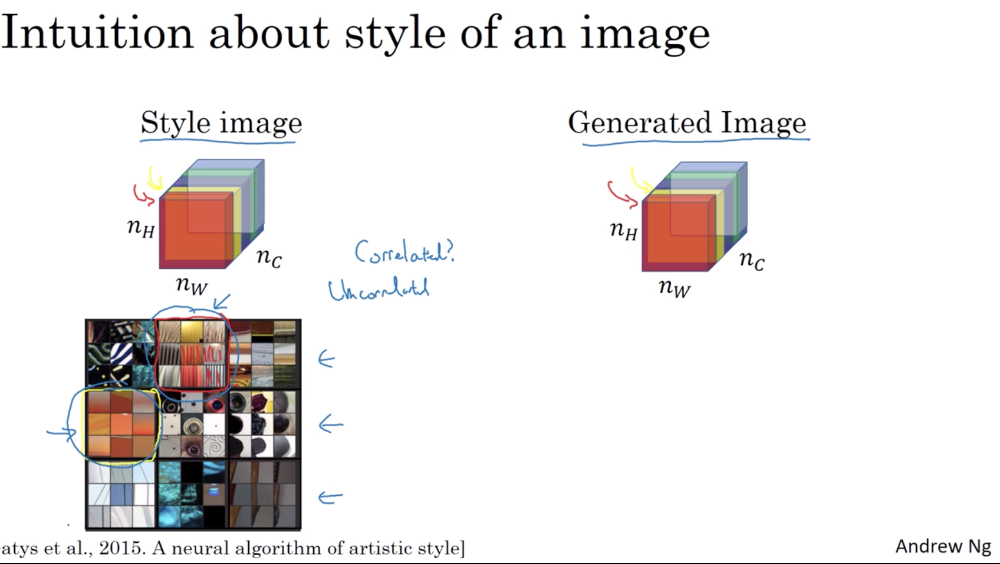
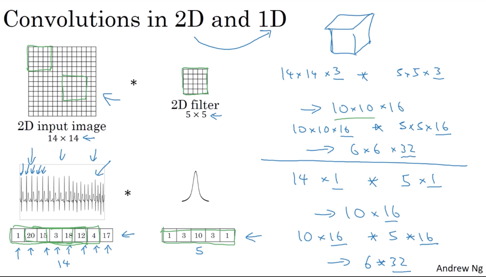
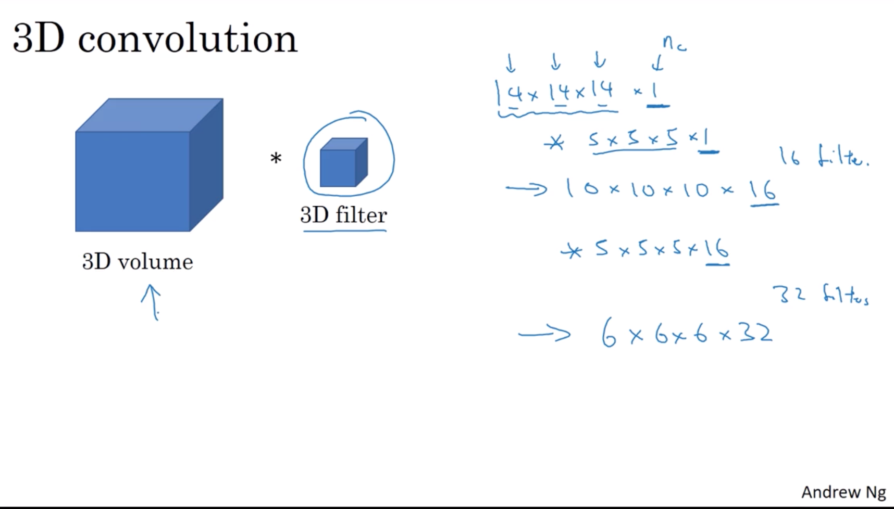

# week 4

- **Face recognition**

    - what is face recognition
        $$
        \begin{array}{l}{\text { Verification }} \\ {\cdot \text { Input image, name/ID }} \\ {\cdot \text { Output whether the input image is that of the }} \\ {\text { claimed person }}\end{array}
        $$

        $$
        \begin{array}{l}{\text { Recognition }} \\ {\cdot \text { Has a database of } \mathrm{K} \text { persons }} \\ {\cdot \text { Get an input image }} \\ {\cdot \text { Output ID if the image is any of the K persons (or }} \\ {\quad \text { "not recognized') }}\end{array}
        $$

    - One shot learning

        Learning from one example to recognize the person again.

        Learning a 'similarity' function(input two images output a similarity):

        $d(\text{img1, img2})$ = degree of difference between images
        $$
        \begin{array}{ll} \text { If } \mathrm{d}(img1, img2)&\leq \tau \quad \text{same}\\
        &\gt\tau \quad \text{diiferent}
        \end{array}
        $$

    - Siamese network

        - using a network to encode input image to a vector. That is using vector to represents image.
            $$
            f(x^{(i)}) \rightarrow V_{\text{encoding of }x^{(i)} }\in \reals^n
            $$
        - Then compute the norm of difference:
            $$
            d\left(x^{(1)}, x^{(2)}\right)=\| f\left(x^{(1)}\right)-f\left(x^{(2)}\right) \|_{2}^{2}
            $$

        - Goal of learning:
            $$
            \begin{array}{ll}
            {\text { Parameters of NN define an encoding } f\left(x^{(i)}\right)} \\ 
            {\text { Learn parameters so that: }} \\ 
            {\text { If } x^{(i)}, x^{(j)} \text { are the same person, }\left\|\mathrm{f}\left(x^{(i)}\right)-\mathrm{f}\left(x^{(j)}\right)\right\|^{2} \text { is small. }}\\ 
            \text { If } x^{(i)}, x^{(j)} \text { are different persons, }\left\|\mathrm{f}\left(x^{(i)}\right)-\mathrm{f}\left(x^{(j)}\right)\right\|^{2} \text { is large. }
            \end{array}
            $$

    - Triplet loss

        - Learning objective

            $$
            \begin{array}{ll}
                \| \mathrm{f}(A) - \mathrm{f}(P)\|^2 - \| \mathrm{f}(A) - \mathrm{f}(N)\|^2 + \alpha(margin) \leq 0
            \end{array}
            $$
            $$
            \begin{array}{llll}
                &A&: &Anchor\\
                &P&: &Positive\\
                &N&: &Negative
            \end{array}
            $$

        - Loss function

            $$
            \begin{array}{llll}
                \mathcal{L}(A,P,N) = \mathop{max}\Big(\| \mathrm{f}(A) - \mathrm{f}(P)\|^2 - \| \mathrm{f}(A) - \mathrm{f}(N)\|^2 + \alpha, \quad 0\Big)
            \end{array}
            $$

            Cost function:
            $$
            \mathcal{J} = \sum_{i=1}^m \mathcal{L}(A^{(i)}, P^{(i)}, N^{(i)})
            $$
        - Choosing the triplets $A,P,N$

            $$
            \begin{array}{l}{\text {During training, if } \mathrm{A}, \mathrm{P}, \mathrm{N} \text { are chosen randomly, }} \\ {d(A, P)+\alpha \leq d(A, N) \text { is easily satisfied. }}\end{array}
            $$
            $$
            \begin{array}{l}
            \text {Choose triplets that're "hard" to train on. }\\\text{That is, hard to identify difference of pairwise images}\end{array}
            $$

    - face verification and binary classification

        - Learning image encoding using triplet loss function.
        - deef there two images' encoding vector into logistic regression model.
        

- **Neural style transfer**

    - what is neural style transfer

        

    - what are deep ConvNets learning

        

    - cost function

        $$
        \mathcal{J}(G) = \alpha \mathcal{J}_{\text{content}}(C, G) + \beta \mathcal{J}_{\text{style}}(S,G)
        $$
        $$\alpha \text{  and  } \beta \text{  are hyperparameters}$$
        $$
        \begin{array}{lll}
            &G&:Generated image\\
            &C&:Content\\
            &S&:Style
        \end{array}
        $$

        - find the generated image $G$
            1. Initiate G randomly
            $G: 100\times 100\times 3$
            2. Use gradient descent to minimize$\mathcal{J}(G)$
            $\\G := G - \frac{\partial}{\partial G}\mathcal{J}(G)$

    - Content cost function

        Given a content image and generated image, how similar are they in content.
        - Say you use hidden layer $l$ to compute content cost. (hidden layers represent the content)
        - Use pre-trained ConvNet. (E.g., VGG network)
        - Let $a^{[l](C)}$ and $a^{[l],(G)}$ be the activation of layer $l$ on the images.
        - If $a^{[l](C)}$ and $a^{[l],(G)}$ are similar, both images have similar content.

        *cost function for content*

        $$
        \mathcal{J}_{\text{content}}(C, G) = \frac{1}{2}\|a^{[l](C)} - a^{[l],(G)} \|^2
        $$

    - Style cost function

        - Say you are using layer $l's$ activation to measure 'style'.
        - Define style as correlation between activation across channels. (regard each channel as a sample distribution, recall how we calculate correlation between two distribution)

        Intuition about style of an image
        

         - Style matrix
            $$
            \begin{array}{cc}
                \text { Let } a_{i, j, k}^{[l]}=\text { activation at }(i, j, k) . G^{[l]} \text { is } \mathrm{n}_{\mathrm{c}}^{[l]} \times \mathrm{n}_{\mathrm{c}}^{[l]}\\\\
                i,j,k \text{  represent the H,W,C}\\\\
                G^{[l]} \text{is all pairwise of each channel}
            \end{array}
            $$
            $$
            \begin{array}{ll}
                G^{[l](S)}_{kk'} &= \sum_{i=1}^{n_{H}^{[l]}} \sum_{j=1}^{n_{W}^{[l]}}a_{i j k}^{[l](S)}a_{i j k'}^{[l](S)}\\
                G^{[l](G)}_{kk'} &= \sum_{i=1}^{n_{H}^{[l]}} \sum_{j=1}^{n_{W}^{[l]}}a_{i j k}^{[l](G)}a_{i j k'}^{[l](G)}
            \end{array}
            $$

            *Cost function for style*
            $$
            \begin{aligned}
                \mathcal{J}^{[l]}_{\text{style}}(S,G) &= \| G^{[l](S)} - G^{[l](G)}\| _F^2\\
                &=\frac{1}{(2 n^{[l]}_H n^{[l]}_W n^{[l]}_C)^2} \sum_k \sum_{k'}\Big( G^{[l](S)}_{kk'} - G^{[l](G)}_{kk'}  \Big)^2
            \end{aligned}
            $$
            
            Overall style cost function, $\lambda^{[l]} is weight matrix hyperparameter$
            $$
            \mathcal{J}_{\text{style}}(S,G) = \sum_l \lambda^{[l]} \mathcal{J}^{[l]}_{\text{style}}(S,G)
            $$

    - 1D and 3D generalizations

        

        