# week 1

- Why sequence models

    - speech recognition
    - music generation
    - sentiment classification
    - DNA sequence analysis
    - machine translation
    - video activity recognition

- **Notation**

    representing words: construct vocabulary, then one-hot encode

- **Recurrent neural network model**

    - why not a standard network

        Problems:
        - inputs, outputs can be different lengths in different examples.
        - Dosen't share features learned across different positions of text.

    - Recurrent Neural Network

        - Forward Propagation

            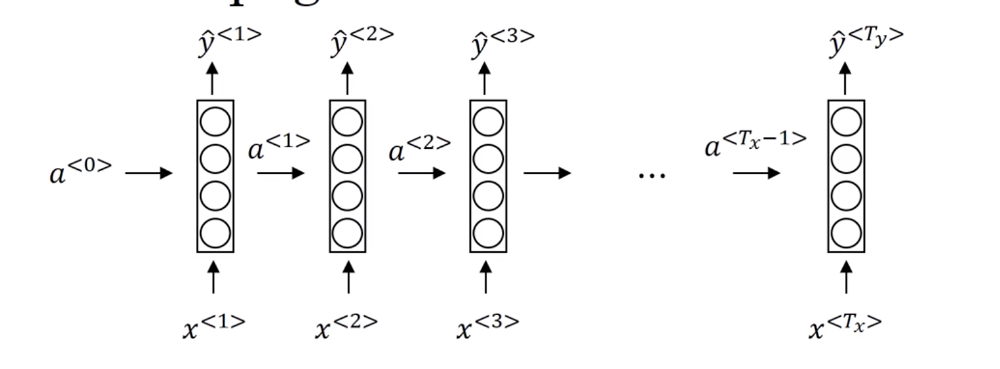

            $$
            \begin{array}{ll}
                init:&  a^{<0>} = \vec{0}\\
                a^{<1>} &= g\big( W_{aa}a^{<0>} + W_{ax}x^{<1>} + b_a\big)\\
                \hat{y}^{<1>} &= g\big( W_{ya}a^{<1>} + b_y \big)\\
                a^{<t>} &= g\big( W_{aa}a^{<t-1>} + W_{ax}x^{<t>} + b_a \big)\\
                \hat{y}^{<t>} &= g\big( W_{ya}a^{<t>} + b_y \big)
            \end{array}
            $$

            simplified RNN notation:
            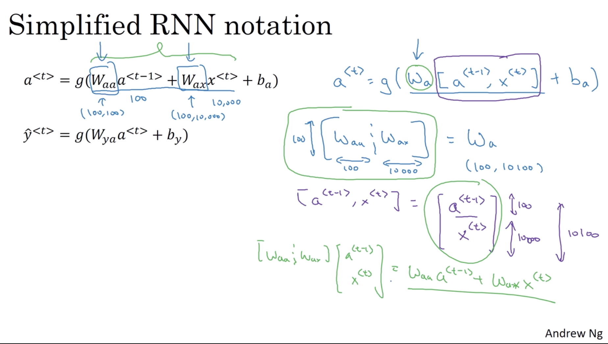

- **Backpropagation through time**

    - Loss function (take logistic regression as an example)

        $$
        \begin{array}{ll}
            \mathcal{L}^{<t>}\left(\hat{y}^{<t>}, y^{<t>}\right)&= - y^{<t>}\log{\hat{y}^{<t>}} - (1-y^{<t>})\log{(1-\hat{y}^{<t>})}\\
            \mathcal{L}\left(\hat{y}^{<t>}, y^{<t>}\right)&= \sum_{t=1}^{T_y}\mathcal{L}^{<t>}\left(\hat{y}^{<t>}, y^{<t>}\right)
        \end{array}
        $$
        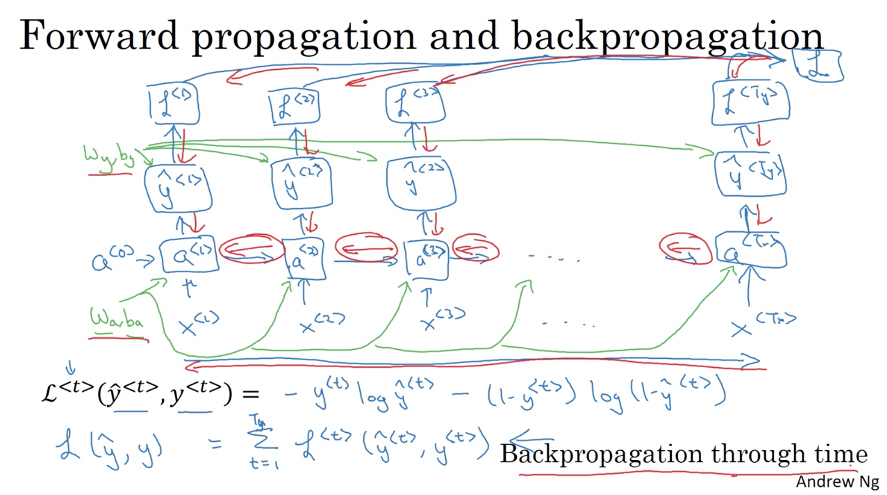

- **Different types of RNNs**

    Recall: $T_x$ and $T_y$, length of the input and output sequence respectively.

    - Examples of RNN architectures

        - many-to-many with same length $T_x = T_y$
        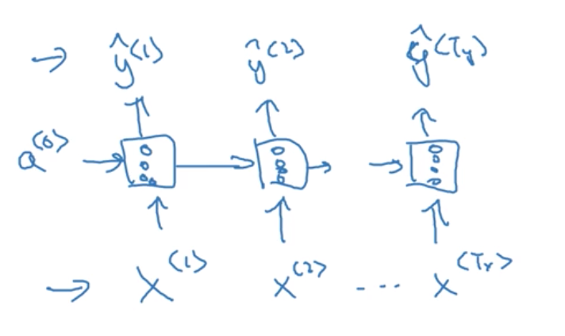
        - many-tomany with different length $T_x \neq T_y$
        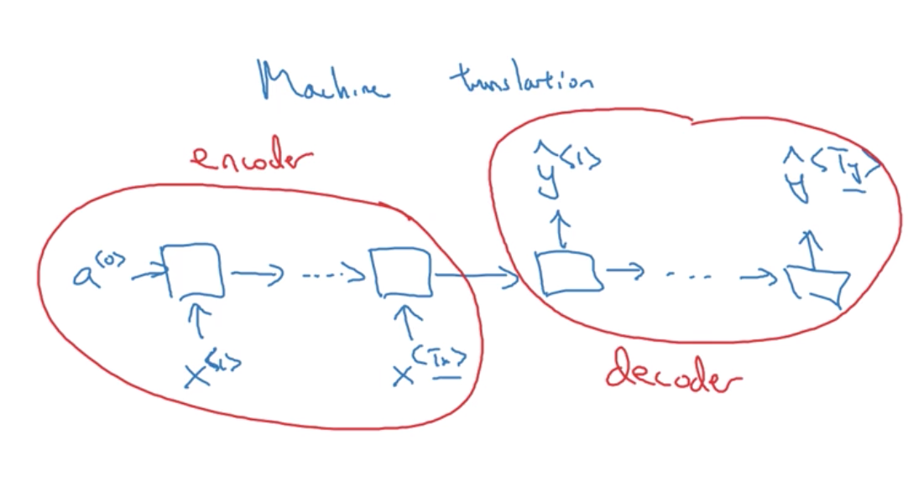
        - many-to-one
        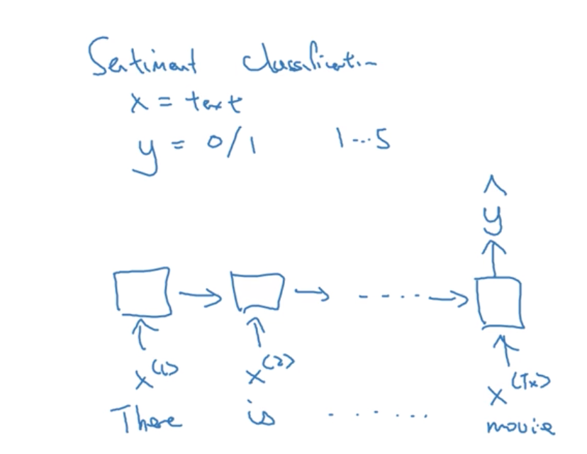
        - one-to-noe
        - one-to-many
        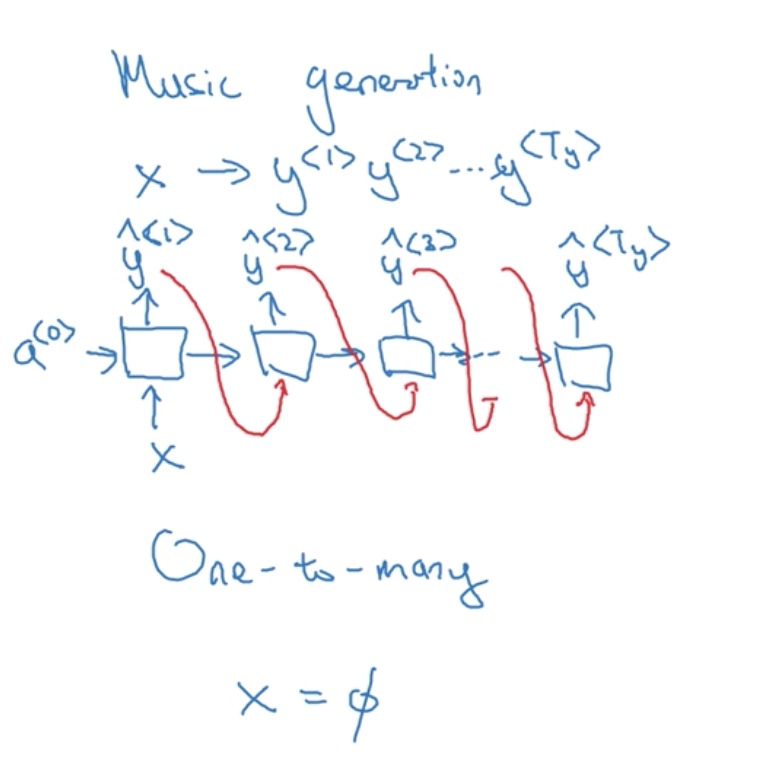

        - summary of RNN types
        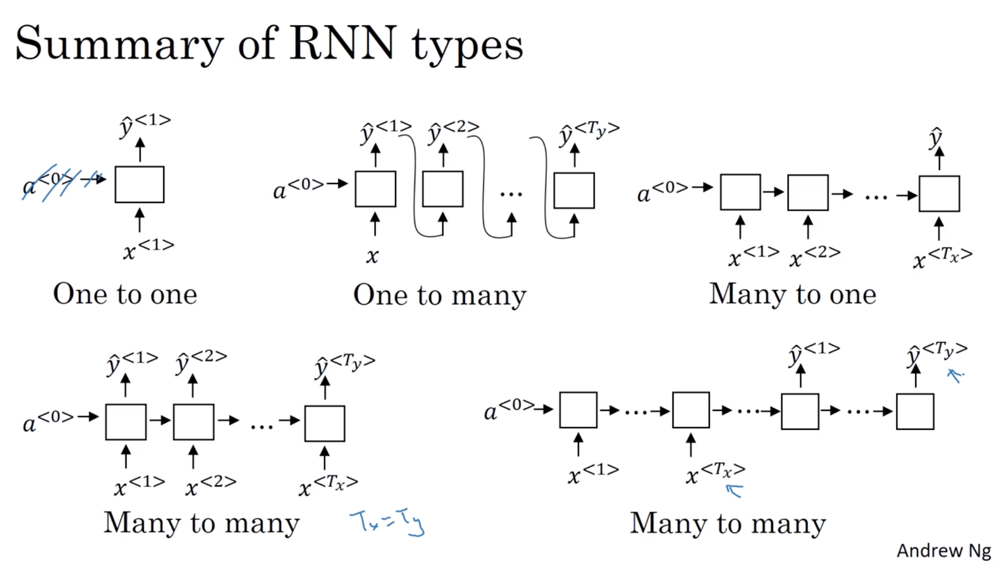

- **Language model and sequence generation**

    - training set: latge corpus of english text. (tokenize)

    - cost function:
        $$
        \begin{array}{rl}
            \mathcal{L}\left(\hat{y}^{<t>}, y^{<t>}\right)&=-\sum_{i} y_{i}^{<t>} \log \hat{y}_{i}^{<t>}\\
            \mathcal{L}&=\sum_{t} \mathcal{L}^{<t>}\left(\hat{y}^{<t>}, y^{<t>}\right)
        \end{array}
        $$

    - model architecture illustration
    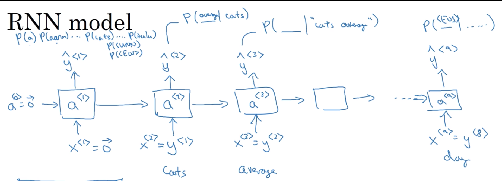
    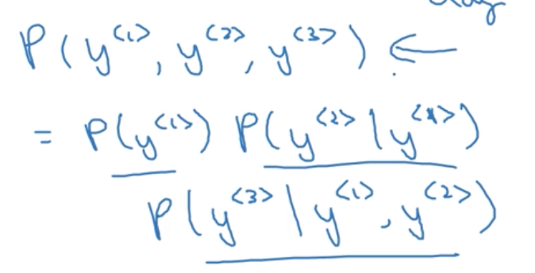

    there, the $y^{<1>}$,$y^{<2>}$,$y^{<3>}$ correspond to the predictions of $\hat{y}^{<1>}$,$\hat{y}^{<2>}$,$\hat{y}^{<3>}$. that means the total probability of concurrence of there three words.

- **Sampling novel sequences**

    - sampling a sequence from a trained RNN to generate new sequene
    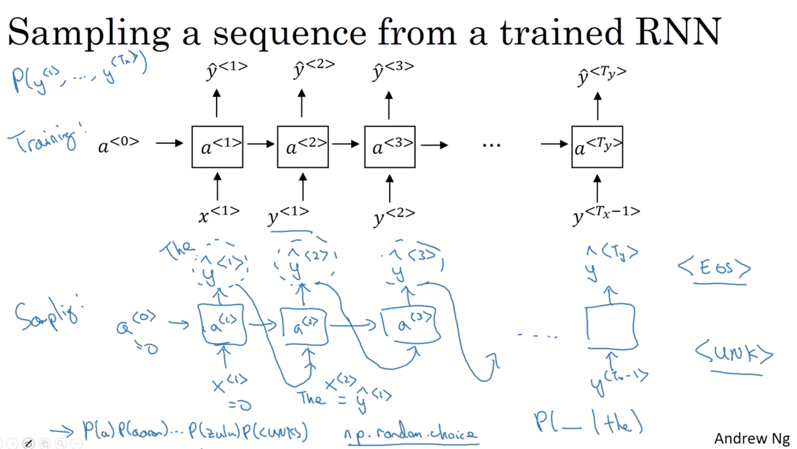

    - character-level language model

        vocabulary is character-level like [a, b, c, d, ..., ;, ', 0, A, B, ..., Z, ...]
        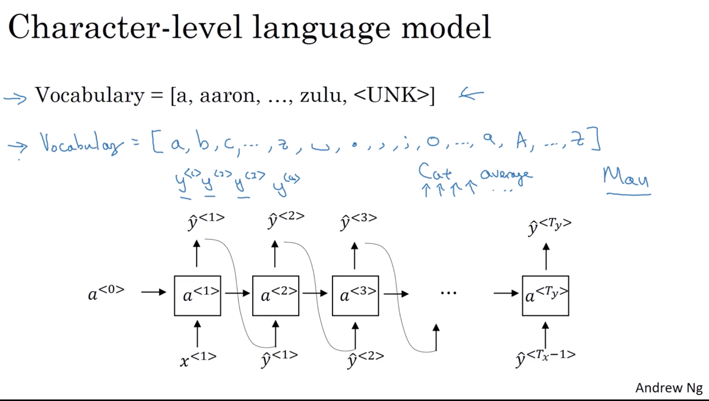

- **Vanishing gradients with RNNs**

    basic RNN is not good at capture long-term denpendences

    exploding gradients: apply gradient clipping(rescale)

- **Gated Recurrent Unit(GRU)**

    better at long range connections and avoid vanishing gradient problems.

    - RNN unit(basic)
    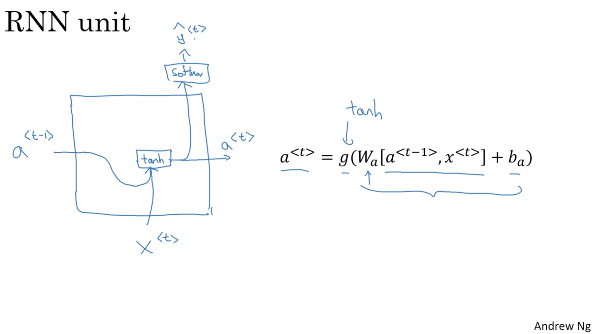

    - GRU (simplified)

        $C =\text{memory cell}$

        - We set $C^{<t>} = a^{<t>}$, that is take the activation output of layer $l$ as the memory cell input to next layer.

        - candidate of replacing $C^{<t>}$ is:
            $$
            \tilde{C}^{<t>} = \mathop{tanh}\big( W_c [C^{<t-1>}, X^{<t>}] + b_c\big)
            $$

        - update gate $0 \text{ or }1$ (decide whether or not to update $C^{<t>}$ with $\tilde{C}^{<t>}$):
            $$
            \Gamma_u = \mathop{sigmoid}\big( W_u[C^{<t-1>}, X^{<t>}] + b_u \big)
            $$

        - summary, the $C^{<t>}$ is:
            $$
            C^{<t>} = \Gamma_u \times \tilde{C}^{<t>} + (1- \Gamma_u) \times C^{^{<t-1>}}
            $$

        - illustration
        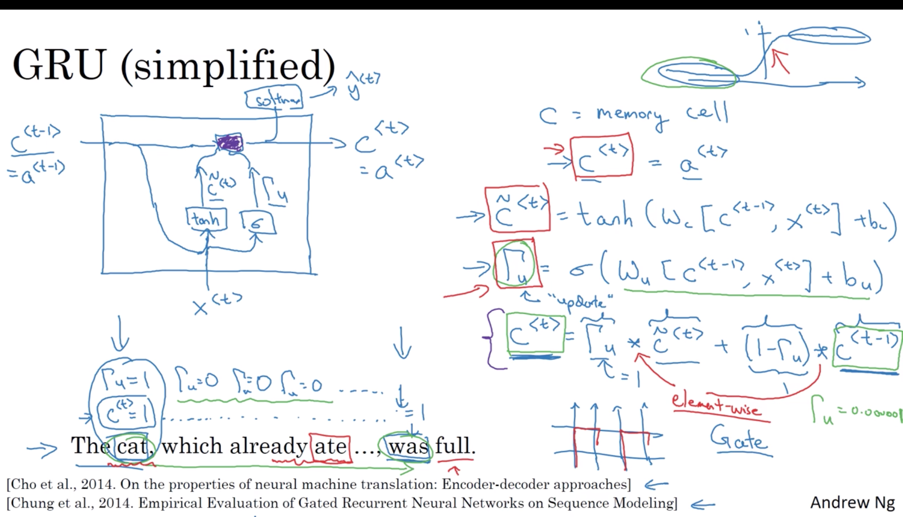

    - Full GRU

        base on simplified GRU, adding revelance gate.
        $$
        \begin{array}{lcl}
            \tilde{c}^{<t>} &=&\tanh \left(W_{c}\left[\Gamma_r \times c^{<t-1>}, x^{<t>}\right]+b_{c}\right) \\ 
            \Gamma_{u} &=&\sigma\left(W_{u}\left[c^{<t-1>}, x^{<t>}\right]+b_{u}\right) \\
            \Gamma_{r} &=&\sigma\left(W_{r}\left[c^{<t-1>}, x^{<t>}\right]+b_{r}\right) \\
            c^{<t>}&=&\Gamma_{u} \times \tilde{c}^{<t>}+\left(1-\Gamma_{u}\right)+c^{<t-1>}\\
            a^{<t>}&=&c^{<t>}
        \end{array}
        $$

- **Long Short Term Memory (LSTM)**

    Replaceing $(1-\Gamma_u)$ with forget gate $\Gamma_f$, and adding output gate.
    $$
    \begin{array}{lcl}
        \tilde{c}^{<t>} &= &\mathop{tanh}\left(W_c\left[a^{<t-1>}, x^{<t>}\right]+b_c\right)\\
        \Gamma_u &= &\sigma\left(W_u\left[ a^{<t-1>},x^{<t>} \right]+b_u\right)\\
        \Gamma_f &= &\sigma\left(W_f\left[ a^{<t-1>},x^{<t>} \right]+b_f\right)\\
        \Gamma_o &= &\sigma\left(W_o\left[ a^{<t-1>},x^{<t>} \right]+b_o\right)\\
        c^{<t>} &=& \Gamma_u \times \tilde{c}^{<t>} + \Gamma_f \times c^{<t-1>}\\
        a^{<t>} &=& \Gamma_o \times \mathop{tanh}c^{<t>}
    \end{array}
    $$

    Illustration:

    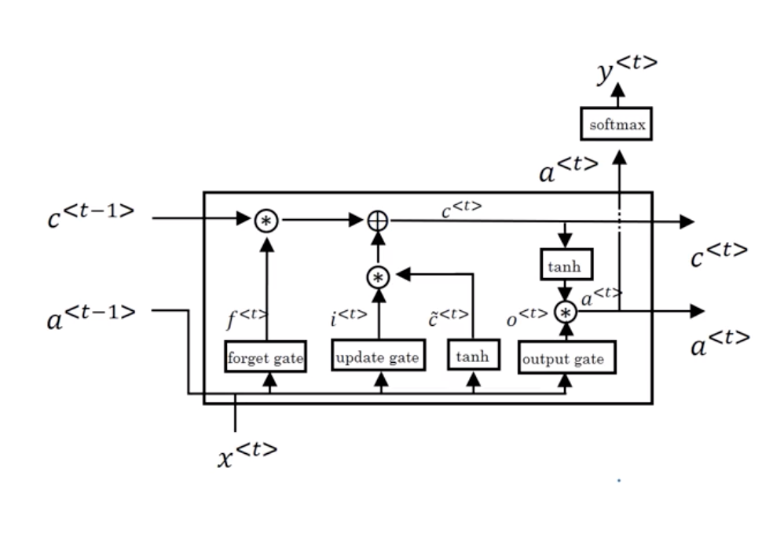
    
    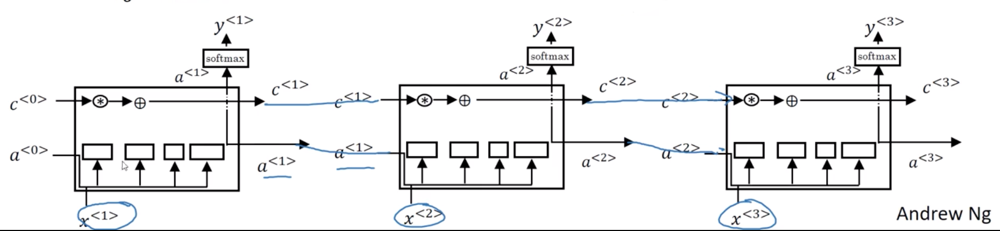

    - variant

        peephole connection: adding $c^{<t-1>}$ to each gate.

- **Bidirectional RNN (BRNN)**

    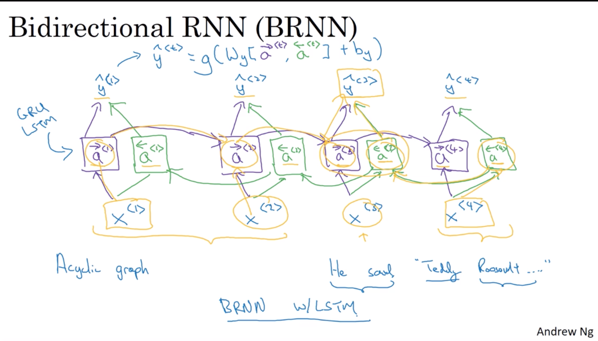

    Using LSTM as BRNN is commom.
    $$
    \hat{y}^{<t>} = g \left(W_y\left[ \overleftarrow{a}^{<t>}, \overrightarrow{a}^{<t>}\right]+b_y\right)
    $$

- **Deep RNNs**

    - deep RNN example

        compute one cell in deep RNN network:

        $$
        a^{[l]<t>} = g\left( W_a \left[ a^{[2]<t-1>}, a^{[1]<t>}\right] + b_a^{l}\right)
        $$

        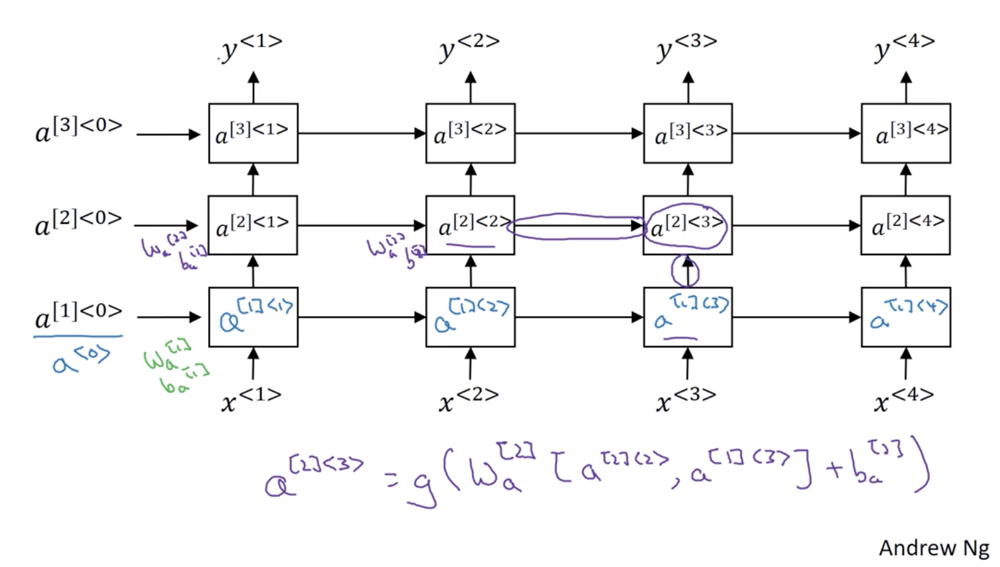