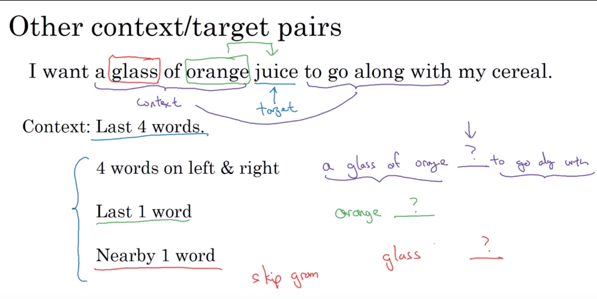
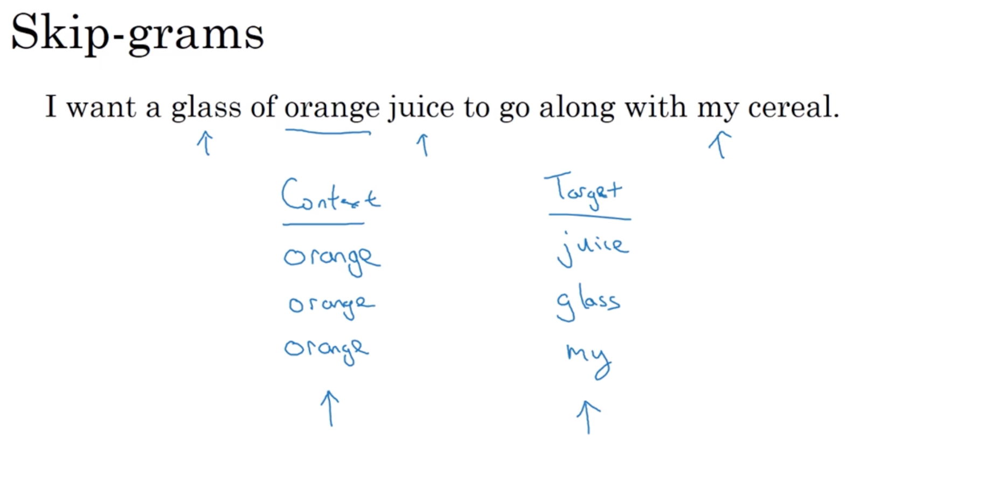
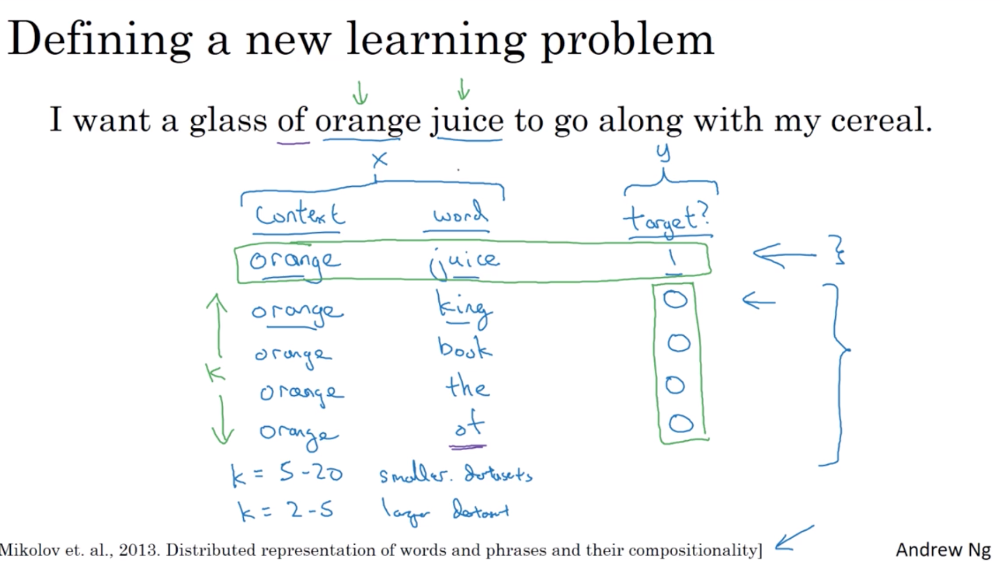
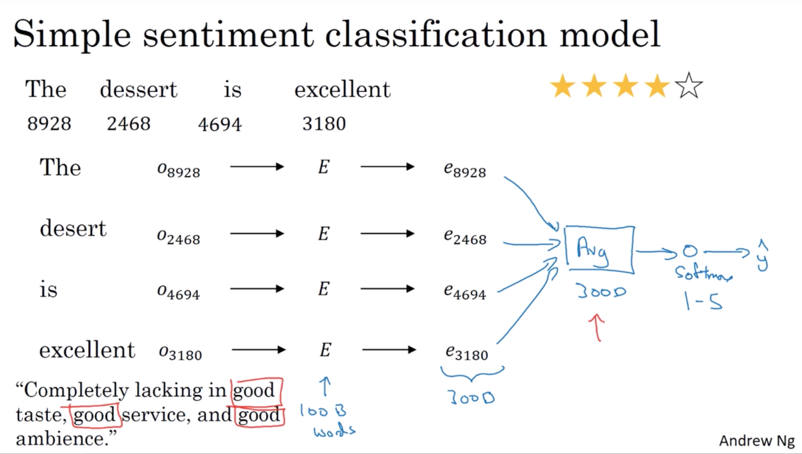
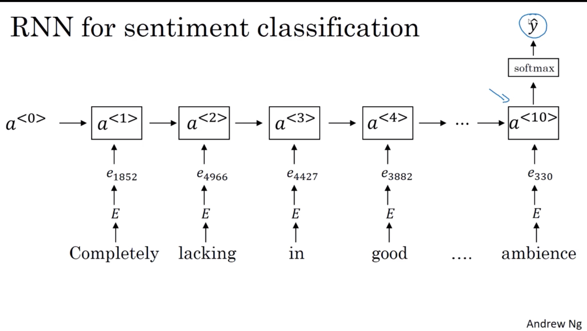
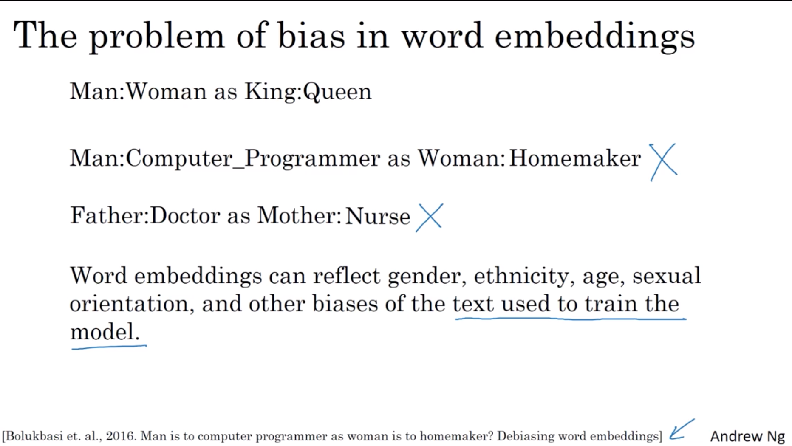
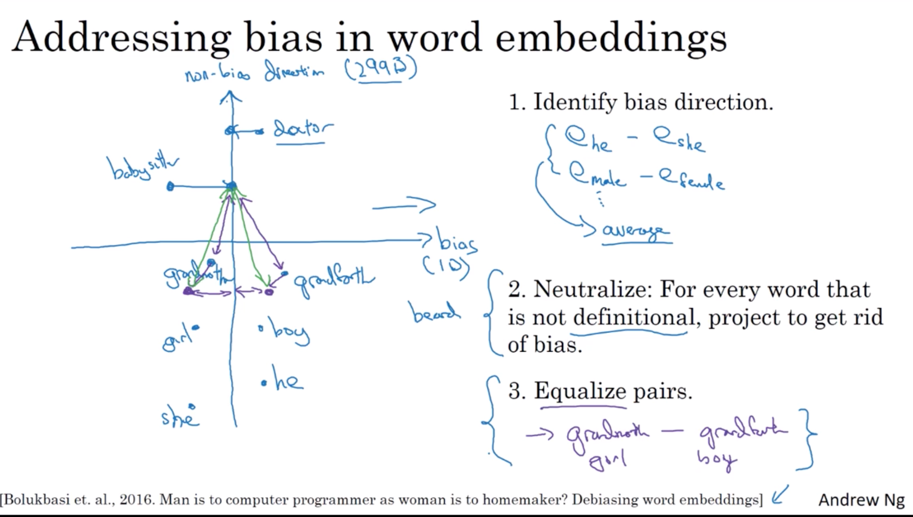

# week 2

- **Intro to Word embeddings**

    - word representation

        - one-hot representation
        - Featurized representation: word embedding
        - visualizing word embeddings: t-SNE

    - using word embeddings

        Transfer learning and word embeddings

        1. learn word embeddings form large text corpus. (1-100B words). (Or download pre-trained embedding online.)
        2. Transfer embedding to new task with smaller training set. (say, 100k words)
        3. Optional: Continuew to finetuen the word embeddings with new data.

    - properties of word embeddings

        $$
        e_{m a n}-e_{\text {woman}} \approx e_{\text {king}}-e_{?}
        $$

        That is:
        $$
        \mathop{argmax}(e_w, e_{man} - e_{woman})
        $$

        - cosine similarity

            $$
            sim(e_w, e_{king}-e_{man}+e_{woman})
            $$

    - embedding matrix

        $$
        E \in \reals^{e\_dim \times vocab\_dim}\\
        O_{j} \in \reals^{vocab\_dim \times 1}
        $$

        from one-hot encoding to embeddings.
        
        $$
        E \cdot O_j = \text{embeddings for word } j
        $$

        actually not efficient to use matrix vector multiplication to do this. In practical, use index to do this instead of matrix multiplication.

- **Learning word embeddings: Word2vec & GloVe**

    - learning word embeddings

        context/target pairs - skip-gram

        

    - Word2vec

        - skip-grams

            

        - Model

            let's say we have vocab size $= 10,000k$, then the model is:

            1. goal: content $c \rightarrow$ target $t$

            2. workflow:\
                $O_c \rightarrow E \rightarrow e_c \xrightarrow{sofrmax} \hat{y}$

            3. prediction probability:
                $$
                \mathop{softmax}: p(t|c) = \frac{e^{\theta_t^T e_c}}{\sum_{j=1}^{10,000}e^{\theta_j^T e_c}} \\
                \theta_t \text{ is the parameter associated with output t}
                $$

            4. loss function:
                $$
                \mathcal{L}(\hat{y}, y) = -\sum_{i=1}^{10,000} y_i \log \hat{y}_i
                $$

        - problems with softmax classification

            $$
            p(t | c)=\frac{e^{\theta_{t}^{T} e_{c}}}{\sum_{j=1}^{10,000} e^{\theta_{j}^{T} e_{c}}}
            $$
            
            the computation is expensive, so applying tree model to retrive the label(word) is more efficient, called hierarchical softmax.

    - Negative sampling

        - defineing a new learning problem

            
            
            negative sampling: sampling in the negative word pairs, e.g., 'orange'-'king', 'orange'-'book', where positive pair is 'orange'-'juice'. The number of sampled pairs is $k$, the larger dataset the smaller $k$.

        - model

            1. previous prediction method:
                $$
                \text { Softmax: } \quad p(t | c)=\frac{e^{\theta_{t}^{T} e_{c}}}{\sum_{j=1}^{10,000} e^{\theta_{j}^{T} e_{c}}}
                $$

            1. redefine the problem:
                $$
                \begin{array}{lll}{{\underline{\text { context }}}} & {\underline{\text { word }}} & {\underline{\text { target? }}}\\{\text { orange }} & {\text { juice }}&{1}\\{\text { orange }} & {\text { king }} & {1} \\ {\text { orange }} & {\text { book }} & {0} \\ {\text { orange }} & {\text { the }} & {0} \\ {\text { orange }} & {\text { of }^{-}} & {0}\end{array}
                $$

            1. new prediction method, using sigmoid:
                $$
                P(y=1 |c, t) = \sigma(\theta_t^T e_c)
                $$
                there we use logistic regression to prediction each content-word pair. So the last layer in the network will be $\text{\# of vocab}$ units, each unit corresponds to each pair.
            1. traing model
                each epoch we only use $k + 1$ content-word pairs to train the model.
            
        - selecting negative examples

            $$
            P(w_i) = \frac{f(w_i)^{3/4}}{\sum^{\text{vocab size}}_{j=1}f(w_i)^{3/4}}
            $$
            use this as heuristic method to sampling, two extremely method are uniform sampling and taking whatever was the observed distribution in your training set.

    - GloVe word vectors(global vectors for word representation)

        - capture how ofen do words $i$ and $j$ appear with each other.
            $$
            X_{i,j} = \text{\# times i apprears in content of j}
            $$

        - model

            1. goal
                $$\begin{array}{l}
                    \mathop{argmin}\left(\sum_{i=1}^{\text{vocab size}}\sum^{\text{vocab size}}_{j=1}f\left(X_{i,j}\right)\left(\theta^T_i e_j + b_i + b_j^{'}-\log X_{i,j}\right)^2\right)\\\\
                    f(X_{i,j}) \text{ is a weighting term}\\\\
                    i: target\\\\
                    j: content
                \end{array}
                $$

- **Applications using Word Embeddings**

    - sentiment classification

        - simple sentiment classification model

            feeding sentences of word embeddings, logistic regression output sentiment.

            
        
        - RNN for sentiment classification

            

    - debiasing word embeddings

        - the problem of bias in word embeddings
        
        

        - addressing bias in word embeddings

            1. identify bias direction
                $$
                \begin{array}{l}
                    e_{he} - e_{she}\\
                    e_{male} - e^{female}\\
                    e_{king} - e_{queen}\\
                    ...\\
                    average these
                \end{array}
                $$
             1. neutralize: for every word that is not definitional, project to get rid of bias.
             2. equalize pairs

            
