# week 3

- **Various sequence to sequence architectures**

  - Basic Models

    1. sequence to sequence model

      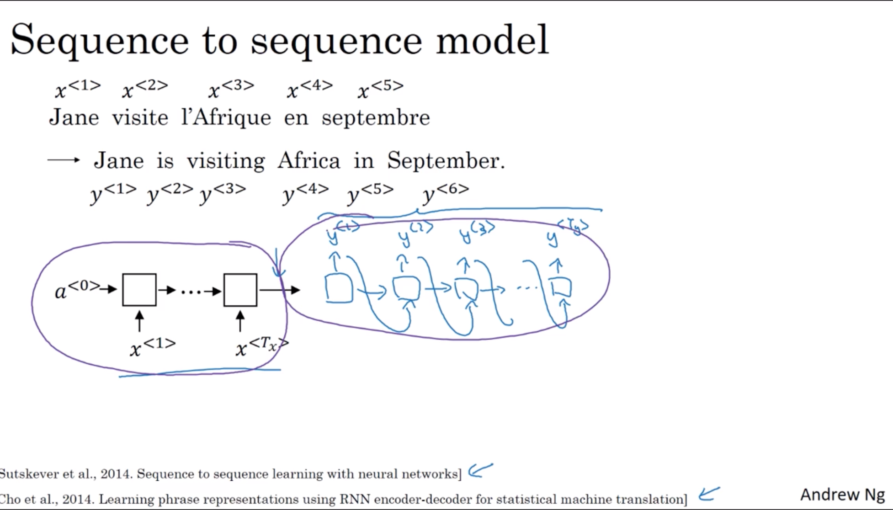

    2. Image captioning
      
      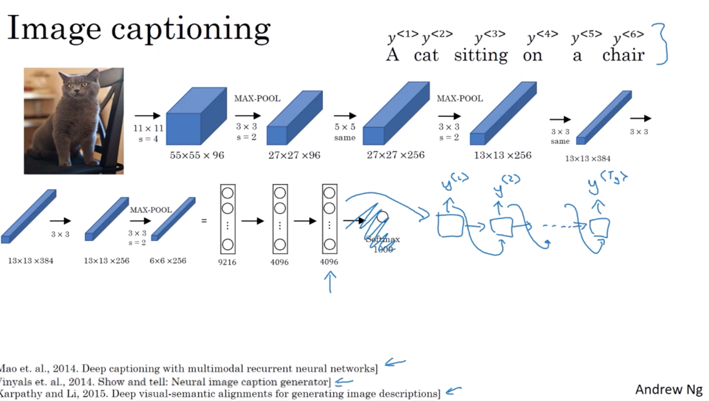

   - Picking the most likely sentence

     - achine translation as building a conditional language model

       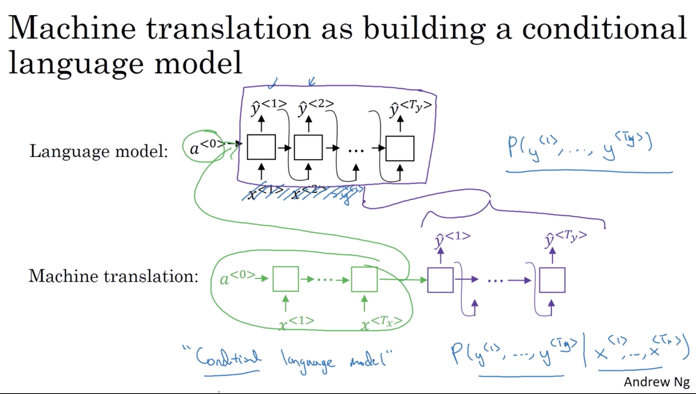

     - Finding the most likely translation

         $$
         \underset{y^{<1>}, \ldots, y^{<T_{y}>}}{\operatorname{argmax}}  P\left(y^{<1>}, \ldots, y^{<T_{y}>} | x\right)
         $$

     - Why not a greedy search

       it is not always optimal to just pick one word at a time.

       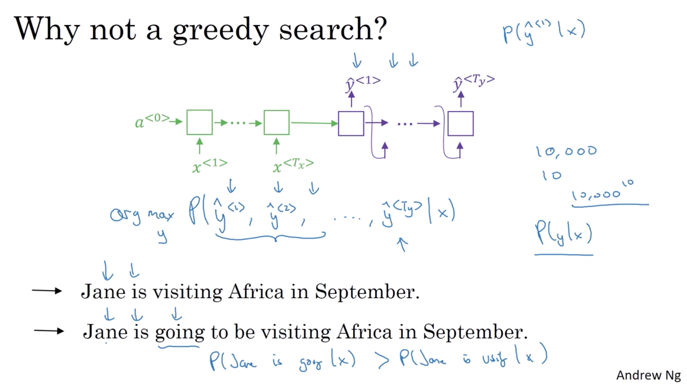

   - Beam Search

     - Beam search algorithm

       $B=3$ (beam width): the number of top possible sentences for each predicted output $\hat{y}^{<i>}$. That is, for the prediction step_1, store 3 sentences with only one word and highest probabilities. for the prediction step_2, store still 3 sentences with two words, and so on.

       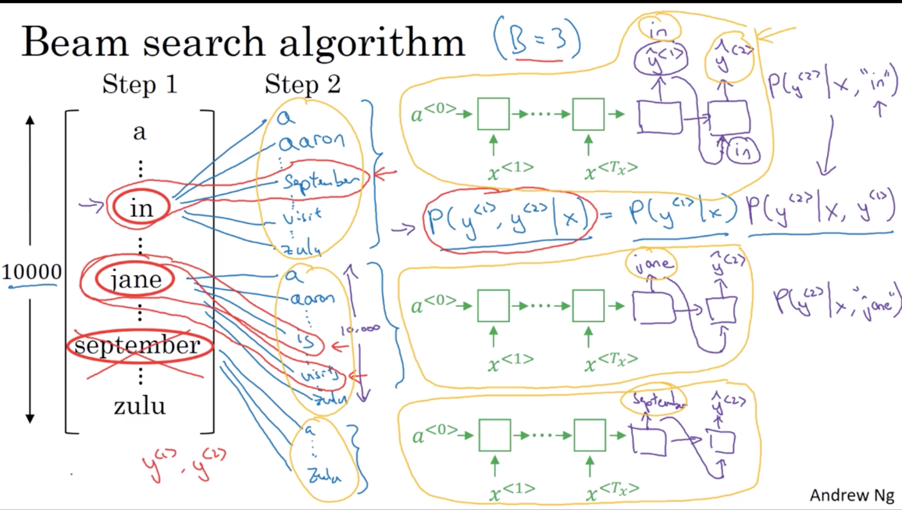

       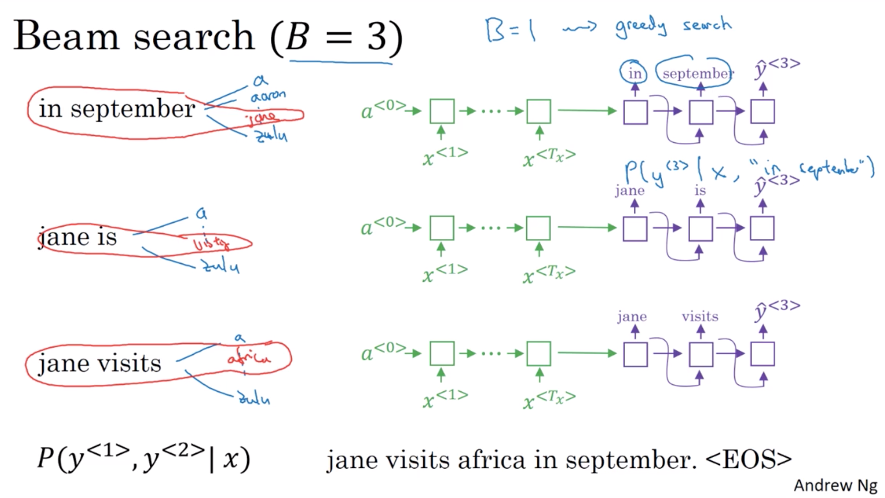

   - Refinements to Beam Search

     - Length normalization

       $$
       \arg \max _{y} \prod_{t=1}^{T_{y}} P\left(y^{<t>} | x, y^{<1>}, \ldots, y^{<t-1>}\right)
       $$
       due to $P$ is always less than $1$, so we take $\log$ to avoid underflow.
       $$
       \arg \max _{y} \sum_{y=1}^{T_{y}} \log P\left(y^{<t>} | x, y^{<1>}, \ldots, y^{<t-1>}\right)
       $$
       there is another problem that also due to $P$ is less than $1$, so the prediction will prefer shorter sentence. So we normalize the objective function to this:
       $$
       \arg \max\frac{1}{T_y^{\alpha}} _{y} \sum_{y=1}^{T_{y}} \log P\left(y^{<t>} | x, y^{<1>}, \ldots, y^{<t-1>}\right)
       $$
       $\alpha$ is hyperparameter.
     
     - Beam search discussion

       - large B: better result, slower
       - small B: worse result, faster

  - Error analysis in beam search

      Human: $y^\star$ \
      Algorithm: $\hat{y}$
      - case 1: $P(y^\star | x) \gt P(\hat{y}| x)$:\
        beam search chose $\hat{y}$, but $y^\star$ attains higher$P(y|x)$.\
        beam search is at fault.

      - case 2: $P(y^\star|x) \leq P(\hat{y}|x)$\
        $y^\star$ is a better translation than $\hat{y}$, but RNN predicted $P(y^\star|x) \lt P(\hat{y}|x)$.\
        RNN model is at fault.

    error analysis process

    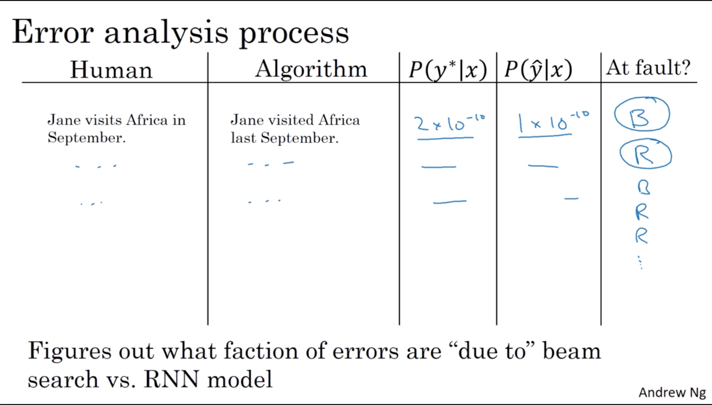

  - Bleu Score(Bilingual evaluation understudy)

    what the Bleu score dose is given a machine generated translation, it allows you to automatically compute a score that measures how good is that machine translation.

    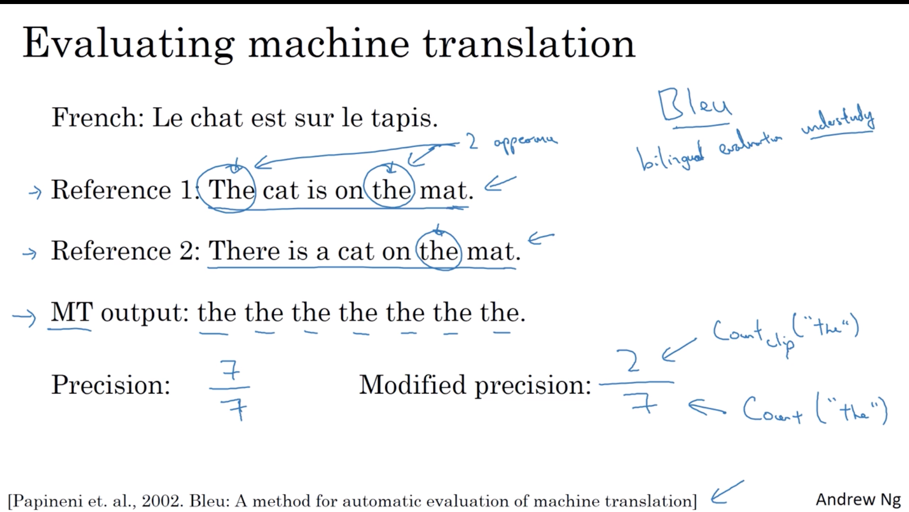
    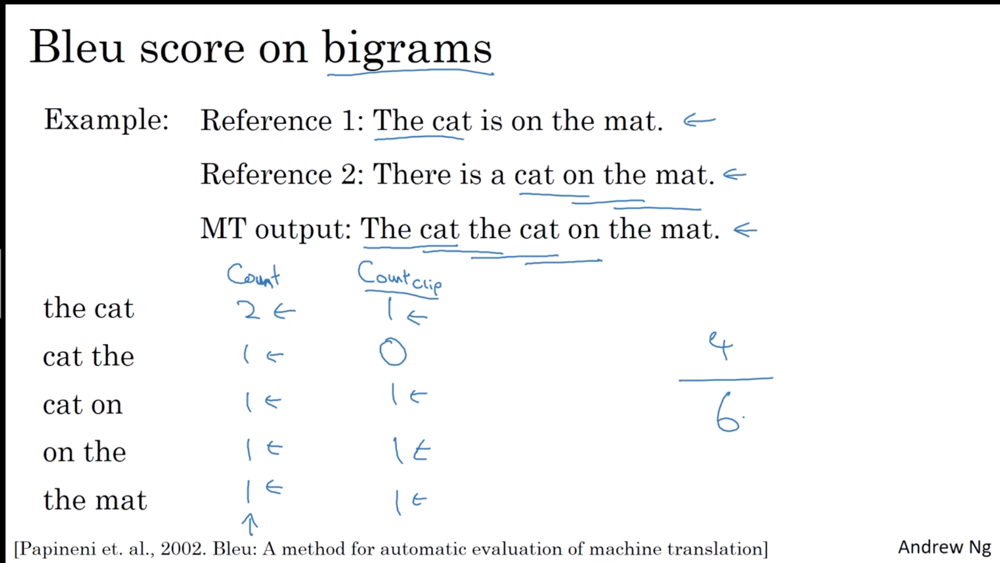

    $$
    P_n = \frac{\sum_{n-grams \in \hat{y} } Count_{\text{clip}}\left(\text{n-grams}\right) }{\sum_{\text{n-grams} \in\hat{y}}Count{\left(\text{n-grams}\right)}}
    $$

    - Bleu details

      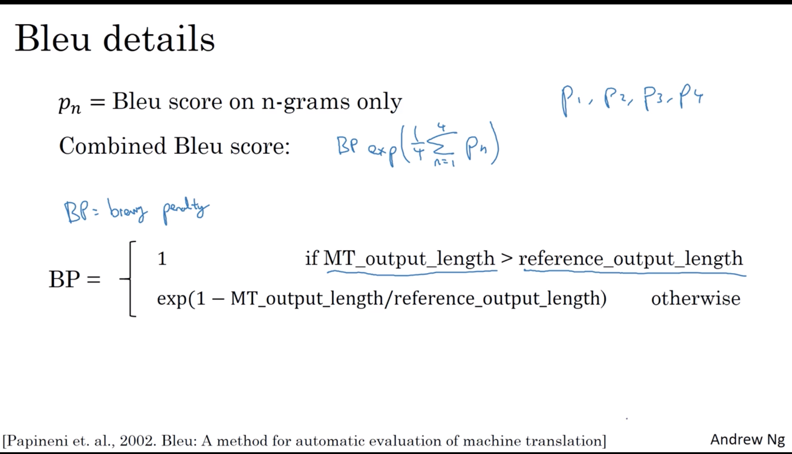

  - Attention Model Intuition

    - the problem of long sequences
    
    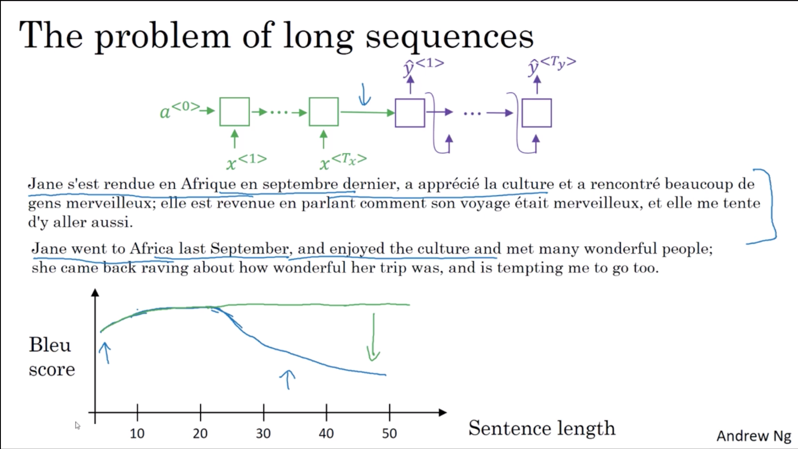

    - attention model intuition
    
    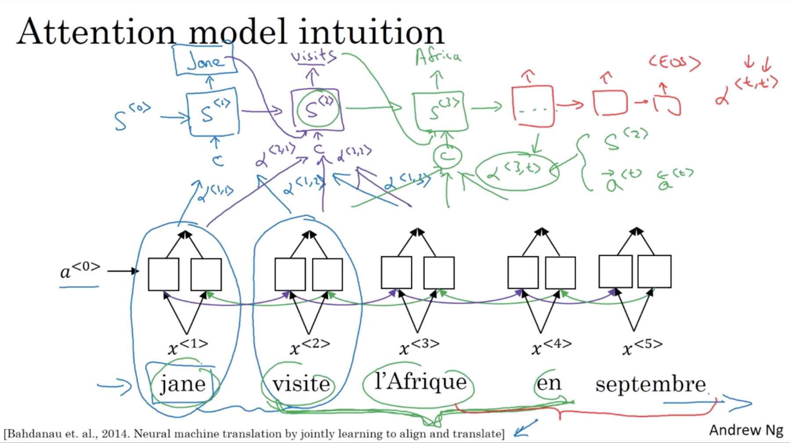

  - Attention Model

    - In the pre-attention stage: (we just illustrate hidden layer at time series, and assume there is a one hidden layer BRNN.)

      $<t>$ represents timestamp;\
      $\rightarrow$ represents forward activation state;\
      $\leftarrow$ represents backward activation state;\
      
      $$
      \begin{array}{ll}
          a^{<0>} \rightarrow &\left[ \overrightarrow{a}^{<1>}, \overleftarrow{a}^{<1>} \right] \rightarrow\\
          &\left[ \overrightarrow{a}^{<2>}, \overleftarrow{a}^{<2>} \right] \rightarrow\\
          &\left[ \overrightarrow{a}^{<3>}, \overleftarrow{a}^{<3>} \right] \rightarrow\\
          &\left[ \overrightarrow{a}^{<4>}, \overleftarrow{a}^{<4>} \right] \rightarrow \left[ \overrightarrow{a}^{<t>}, \overleftarrow{a}^{<t>} \right]
      \end{array}
      $$

    - In the post-attention stage, the sampling RNN accept state $s^{<t>}$ from previous unit and context $c$ from attention, then output the predicted words/sequence.

      $$
      \begin{array}{ll}
          \text{encoder has }t^\prime \text{times/steps}\\
          \text{decoder has }t\text{ times/steps}\\\\
          a^{<t^\prime>} = \left(\overrightarrow{a}^{<t^\prime>}, \overleftarrow{a}^{<t^\prime>}\right)\\\\
          c^{<1>} = \sum_{t^\prime} \alpha^{<1,t^\prime>} a^{<t^\prime>} \quad \text{subject to: } \sum_{t^\prime} \alpha^{<1,t^\prime>} = 1\\
          c^{<2>} = \sum_{t^\prime} \alpha^{<2,t^\prime>} a^{<t^\prime>} \quad \text{subject to: } \sum_{t^\prime} \alpha^{<2,t^\prime>} = 1\\
          c^{<t>} = \sum_{t^\prime} \alpha^{<t,t^\prime>} a^{<t^\prime>} \quad \text{subject to: } \sum_{t^\prime} \alpha^{<t,t^\prime>} = 1\\
          \ldots\\\\
          \alpha^{<t,t^\prime>} = \text{amount of "attention" } y^{<t>} \text{should pay to }a^{<t^\prime>}\\
      \end{array}
      $$

      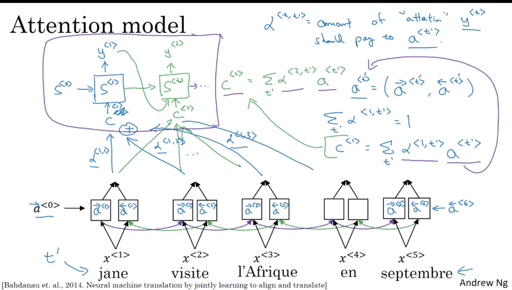

    - computing attention $a^{<t, t^\prime>}$

      $$
        a^{<t,t^\prime>} = \frac{\exp \left( e^{<t,t^\prime>} \right)}{\sum_{t^\prime =1}^{T_x} \exp \left( e^{<t,t^\prime>} \right)}
      $$

      computing $e^{<t,t^\prime>}$

      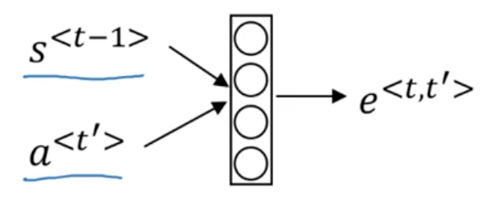
      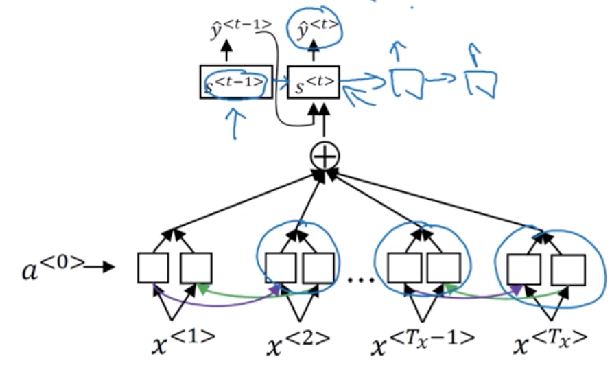

- **Seepch recognition - Audio data**

  - Speech recognition

    - speech recognition problem
    
    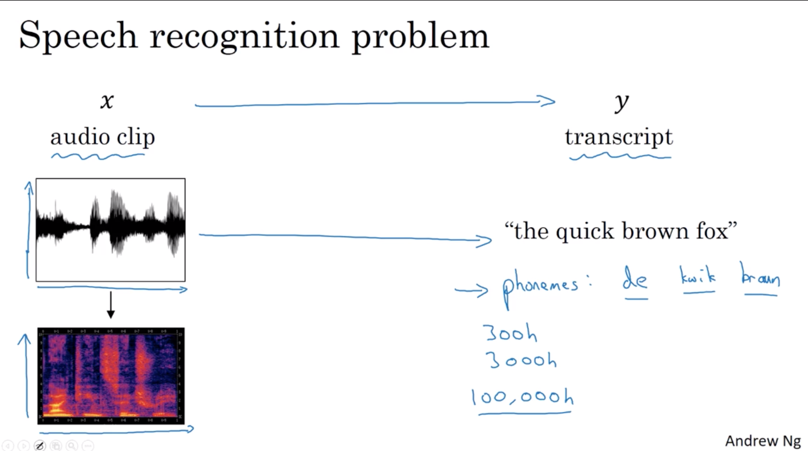

    - attention model for speech recognition

    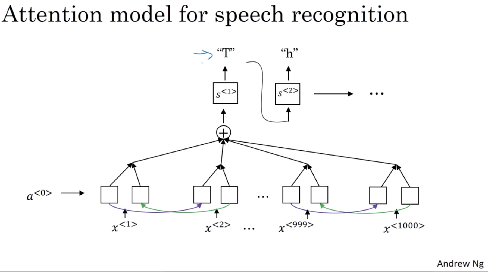

    - CTC cost for speech recognition (Connectionist temporal classification)

    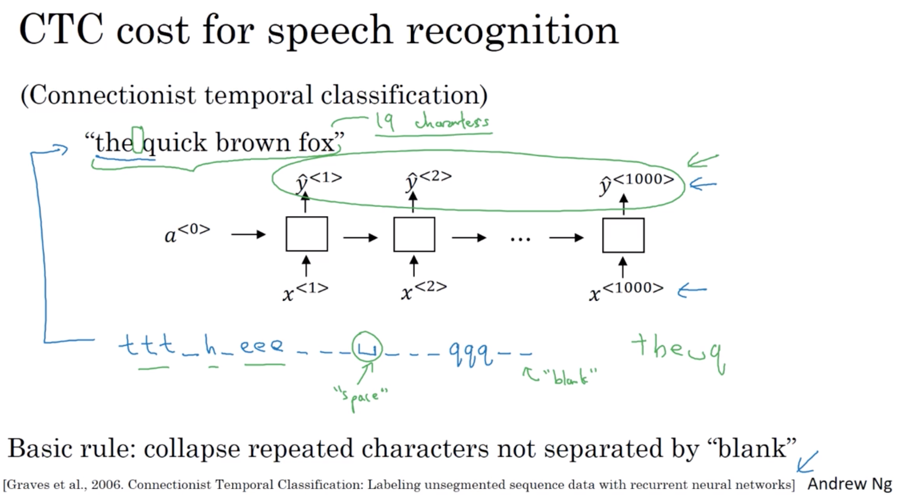

  - Triggre Word Detection

    - trigger word detection algorithm
    
    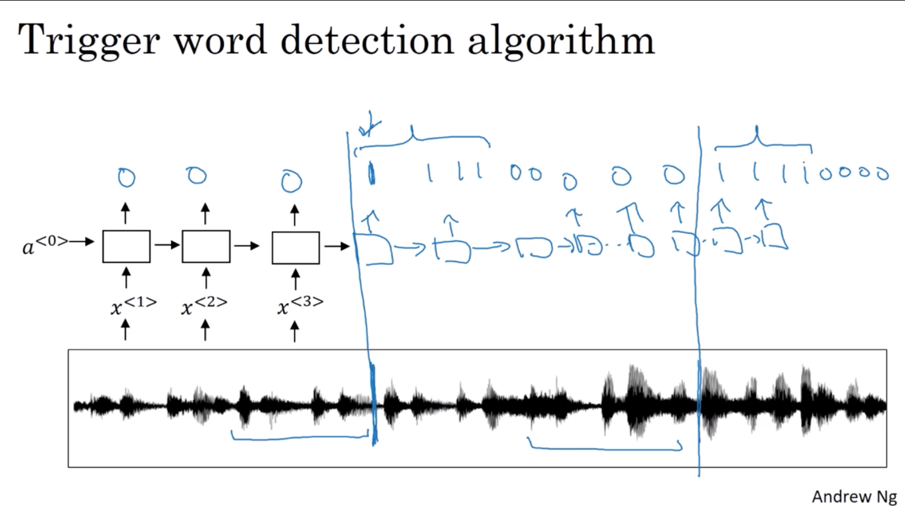

- **Conclusion**

  $$
  \begin{array}{l}{\text { 1. Neural Networks and Deep Learning }} \\ {\text { 2. Improving Deep Neural Networks: Hyperparameter }}  {\text { tuning, Regularization and Optimization }} \\ {\text { 3. Structuring Machine Learning Projects }} \\ {\text { 4. Convolutional Neural Networks }} \\ {\text { 5. Sequence Models }}\end{array}
  $$

  